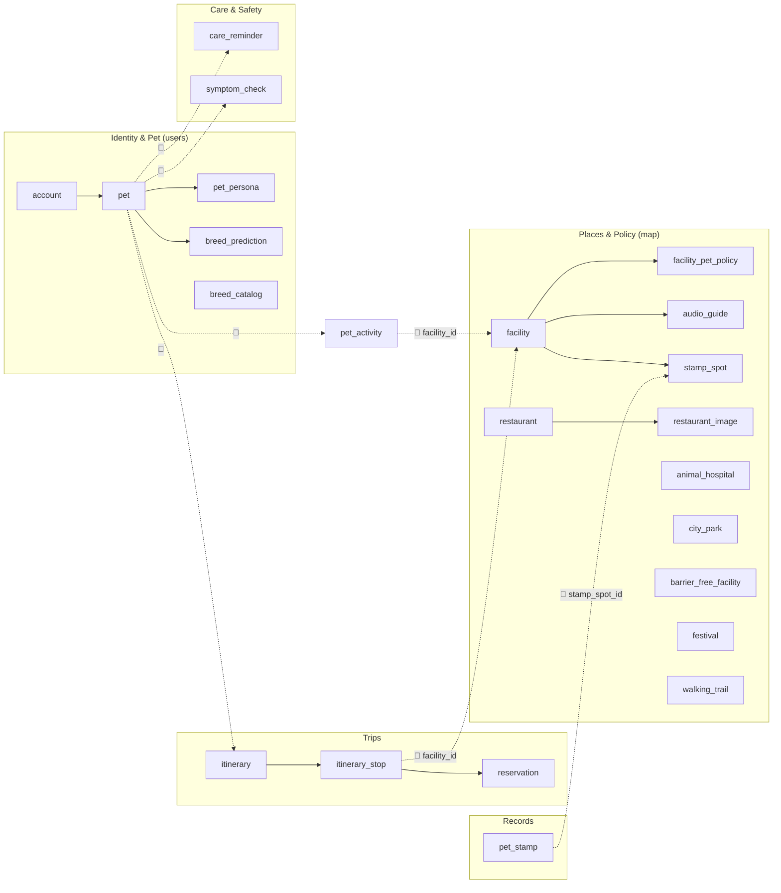

# 발자국(Baljaguk) — 전체 기능 통합 ERD

> HTML 프로토타입(`발자국 AI 반려동물 여행 플래너.html`)의 화면(A1~H5)을 기준으로 도출한 데이터 모델. 꾸미기·브이로그·커뮤니티(F·G·H1~H3·H5) 기능은 제거되어 모델에서 제외한다(펫 패스포트 H4는 집계 뷰로 유지).
> 초기 구현 스키마(13개 테이블, 마이그레이션 `96a7fd767f47`·`b7e2c9a4d1f3`)의 컨벤션·해설을 계승하고, 확장 기능에 필요한 신규 엔티티를 **제안**으로 확장한다.
> 구현·제안·예정을 **하나의 통합 ERD(§2)** 로 합쳐 그렸다.

**범례**
- 박스 제목은 `영문 테이블명 · 한글 [상태]` (영문 = 실제/예정 DB 테이블명)
- **상태**: `[구현]` = 초기 마이그레이션(`96a7fd767f47`·`b7e2c9a4d1f3`)에 존재 · `[제안]` = HTML 근거로 추가(데모는 CSV/Mock, 풀 3NF DB 단계 적재) · `[예정]` = 초기 설계의 미구현 시설 소셜(리뷰) 보존
- **실선(`--`) = 식별 관계**: 부모 FK가 자식 PK의 일부(자식이 부모 없이 존재 불가)
- **점선(`..`) = 비식별 관계**: FK가 자식의 일반 컬럼
- 까마귀발: `||` 정확히 1 · `|o` 0 또는 1 · `o{` 0 이상 · `|{` 1 이상
- **🔗 논리 참조**: 다른 컨텍스트의 PK를 의미상 참조하나 **FK 미선언**(`pet_activity.facility_id` 패턴). 통합 ERD에서는 가독성을 위해 점선 관계선으로 그리되 라벨에 🔗를 붙여 FK 미선언임을 표시. 실제 미선언 목록은 §4 참조맵.
- 파생 read 모델(`entry_verdict`·`policy_card`·`route_planner`·`safety_alert`)은 테이블이 없어 제외(입장 판정·배지는 런타임 규칙)

---

## 1. 화면(A~H) → 엔티티 매핑

| 화면          | 기능                | 주요 엔티티                                                                                               |
| ----------- | ----------------- | ---------------------------------------------------------------------------------------------------- |
| **A1~A4**   | 시작·사진·견종 인식(ML)   | `account`, `pet`, `breed_catalog`, `breed_catalog_trait`, **`breed_prediction`**                     |
| **A5~A6**   | 프로필 입력·자동 분류      | `pet`, `pet_trait`                                                                                   |
| **B1~B3**   | 페르소나·실사 히어로·특징 편집 | `pet`, `pet_trait`, **`pet_persona`**                                                                |
| **C1~C2**   | AI 프롬프트·추천 코스     | **`itinerary`**, **`itinerary_stop`** 🔗 `facility`, **`restaurant`**·**`restaurant_image`**(식사 정류장), **`city_park`**(야외·산책 슬롯) |
| **C3~C5**   | 시설 상세·입장 판정·배지    | `facility`, `facility_pet_policy`, `facility_allowed_pet_size` *(배지=런타임)*                            |
| **C6**      | 발자국 지도·동선         | `itinerary_stop`(seq)                                                                                |
| **C7~C9**   | 무장애 토글·배려 시설      | `barrier_free_facility`, `barrier_free_feature`                                                      |
| **C10~C11** | 식당·숙소 예약(mock)    | **`reservation`** 🔗 `facility`                                                                      |
| **C12**     | 닮은 친구 추천(코호트)     | `pet_activity` *(런타임 집계)*                                                                            |
| **D1~D2**   | 케어 타임라인·알림        | **`care_reminder`**                                                                                  |
| **D3~D5**   | QR·오디오 가이드        | **`audio_guide`** 🔗 `facility`                                                                      |
| **D6~D9**   | 응급 증상 체크(참고용)     | **`symptom_check`**                                                                                  |
| **D10~D11** | 가까운 병원            | **`animal_hospital`**(행안부 표준데이터, 영업상태·전화·좌표)                                                         |
| **E1~E2**   | 축제 캘린더·리스트        | **`festival`**                                                                                       |
| **E3**      | 걷기 코스(두루누비)       | **`walking_trail`**                                                                                  |
| **E4**      | 스탬프 컬렉션           | **`stamp_spot`**, **`pet_stamp`**                                                                    |
| **H4**      | 펫 패스포트            | *(집계 뷰: `pet_activity`+`pet_stamp`)*                                                               |

---

## 2. 통합 ERD (전체 한 장)

구현(17)·제안(12)·예정(1) 전 엔티티를 하나의 ERD로 통합. 박스 제목 끝 `[구현]`/`[제안]`/`[예정]`으로 상태를 구분하고, 컨텍스트 경계를 넘는 참조(🔗)는 점선으로 이어 전 엔티티가 한 장에 연결되게 했다(FK는 §4대로 미선언).

```mermaid
erDiagram
    %% ════════ [구현] 공유 차원 ════════
    region["region · 지역 [구현]"] {
        int id PK "지역 ID"
        string name "지역명"
        int level "1=시도 2=시군구"
        int parent_id FK "상위 지역(nullable)"
    }
    category["category · 분류 [구현]"] {
        int id PK "분류 ID"
        string name "분류명"
        int level "1=대 2=중 3=소"
        int parent_id FK "상위 분류(nullable)"
    }
    %% ════════ [구현] 시설(map) ════════
    facility["facility · 시설 [구현]"] {
        int id PK "시설 ID"
        string name "시설명"
        float latitude "위도"
        float longitude "경도"
        int region_id FK "지역(nullable)"
        int category_id FK "분류(nullable)"
        string road_address "도로명주소"
        string jibun_address "지번주소"
        string phone "전화번호"
        string operating_hours "운영시간"
        string homepage "예약/홈페이지 URL"
    }
    facility_pet_policy["facility_pet_policy · 반려동물 정책 [구현]"] {
        int facility_id PK,FK "시설"
        bool companion_allowed "동반 가능"
        string restriction "제한사항"
        string extra_fee "추가 요금"
        bool indoor "실내 여부"
        bool outdoor "실외 여부"
    }
    facility_allowed_pet_size["facility_allowed_pet_size · 허용 크기 [구현]"] {
        int facility_id PK,FK "시설"
        string pet_size PK "허용 크기"
    }
    restaurant["restaurant · 음식점 [구현]"] {
        int id PK "음식점 ID"
        string name "식당명"
        float latitude "위도"
        float longitude "경도"
        int region_id FK "지역(nullable)"
        string cuisine "업태(한식/커피숍…, 표시용)"
        string phone "전화번호"
        string road_address "도로명주소"
        string jibun_address "지번주소"
        string status "식당상태"
        string thumbnail_url "대표 이미지(역정규화)"
        bool pet_friendly "펫동반 매칭 여부"
        bool recommended "모범음식점 매칭(품질)"
    }
    restaurant_image["restaurant_image · 음식점 이미지 [구현]"] {
        int restaurant_id PK,FK "음식점"
        int seq PK "이미지 순서"
        string url "이미지 URL"
    }
    animal_hospital["animal_hospital · 동물병원 [구현]"] {
        int id PK "병원 ID"
        string name "사업장명"
        float latitude "위도(WGS84 변환)"
        float longitude "경도(WGS84 변환)"
        int region_id FK "지역(nullable)"
        string phone "전화번호"
        string road_address "도로명주소"
        bool is_open "영업 여부"
    }
    city_park["city_park · 도시공원 [구현]"] {
        int id PK "공원 ID"
        string name "공원명"
        string park_type "공원구분(근린/수변/문화…)"
        float latitude "위도"
        float longitude "경도"
        int region_id FK "지역(nullable)"
        string road_address "도로명주소"
        string jibun_address "지번주소"
        string phone "전화번호"
    }
    barrier_free_facility["barrier_free_facility · 이동약자 배려시설 [구현]"] {
        int id PK "시설 ID"
        string name "시설명"
        float latitude "위도"
        float longitude "경도"
        int region_id FK "지역(nullable)"
        int category_id FK "분류(nullable)"
        string road_address "도로명주소"
    }
    barrier_free_feature["barrier_free_feature · 배려 요소 [구현]"] {
        int facility_id PK,FK "시설"
        string feature_code PK "배려 요소 코드"
    }
    %% ════════ [구현] 사용자/반려동물(users) ════════
    account["account · 회원 계정 [구현]"] {
        int id PK "회원 ID"
        string email UK "이메일(고유)"
        string password_hash "비밀번호 해시"
        string nickname "닉네임"
        datetime created_at "가입일시"
    }
    pet["pet · 반려동물 [구현]"] {
        int id PK "반려동물 ID"
        int account_id FK "회원"
        string breed "견종(🔗 breed_catalog)"
        string name "이름"
        string photo_url "사진 URL"
        string size "크기(개체값)"
        string temperament "기질(개체값)"
        int birth_year "출생연도(nullable)"
        string gender "성별"
        string features "특징(자유서술 nullable)"
    }
    pet_trait["pet_trait · 반려동물 체질 [구현]"] {
        int pet_id PK,FK "반려동물"
        string trait PK "체질"
    }
    breed_catalog["breed_catalog · 견종 표준정보 [구현]"] {
        string breed PK "견종(정규화 키)"
        string display_name "표시명(nullable)"
        string size "표준 크기"
        string temperament "표준 기질"
    }
    breed_catalog_trait["breed_catalog_trait · 견종 체질 [구현]"] {
        string breed PK,FK "견종"
        string trait PK "체질"
    }
    pet_activity["pet_activity · 행동 로그 [구현]"] {
        int id PK "행동 ID"
        int pet_id FK "반려동물(코호트 단위)"
        int facility_id "시설(🔗 facility, FK 미선언)"
        string action_type "행동 유형(방문/저장)"
        datetime occurred_at "발생 시각"
    }

    %% ════════ [제안] Identity 확장 — A·B ════════
    breed_prediction["breed_prediction · 견종 인식 후보 [제안]"] {
        int id PK "후보 ID"
        int pet_id FK "반려동물"
        string candidate_breed "후보 견종(🔗 breed_catalog)"
        float similarity "유사도 0~1(닮은 친구 %)"
        int rank "순위 · uniq(pet_id,rank)"
    }
    pet_persona["pet_persona · 페르소나 [제안]"] {
        int pet_id PK,FK "반려동물"
        string intro_text "자기소개(LLM)"
        string hero_image_url "실사 히어로"
        string mascot_image_url "마스코트안"
        string tone "말투"
        datetime created_at "생성일시"
    }

    %% ════════ [제안] Trips — C 핵심 ════════
    itinerary["itinerary · 추천 코스 [제안]"] {
        int id PK "코스 ID"
        int pet_id "반려동물(🔗 pet)"
        string title "코스명(멍품 코스)"
        int region_id "지역(🔗 region)"
        string prompt_text "AI 한 줄 입력(C1)"
        bool is_saved "저장 여부"
        datetime created_at "생성일시"
    }
    itinerary_stop["itinerary_stop · 동선 경유지 [제안]"] {
        int itinerary_id PK,FK "코스"
        int seq PK "방문 순서"
        int facility_id "시설(🔗 facility)"
        string transport "도보/차량"
        float distance_from_prev_km "직전 경유지 거리"
        string note "그늘길/물그릇 등"
    }
    reservation["reservation · 예약(mock) [제안]"] {
        int id PK "예약 ID"
        int itinerary_id FK "코스(복합 FK→stop)"
        int seq FK "경유지 순서(복합 FK→stop)"
        int pet_id "반려동물(🔗 pet)"
        string type "restaurant/lodging"
        int party_size "인원"
        string price "금액(mock)"
        string status "상태(mock)"
        datetime reserved_at "예약일시"
    }

    %% ════════ [제안] Places 마스터 — D·E·F ════════
    audio_guide["audio_guide · 오디오 가이드 [제안]"] {
        int id PK "가이드 ID"
        int facility_id FK "시설"
        string language "언어(ko)"
        string script_text "각색 대본(LLM)"
        string audio_url "TTS(강아지 목소리)"
    }
    stamp_spot["stamp_spot · 스탬프 대상 [제안]"] {
        int id PK "스탬프 ID"
        int facility_id FK "시설"
        int region_id FK "지역(nullable)"
        string name "스탬프명"
        string theme "테마"
    }
    festival["festival · 축제 [제안]"] {
        int id PK "축제 ID"
        int region_id FK "지역(nullable)"
        string name "축제명"
        date start_date "시작일"
        date end_date "종료일"
        bool pet_allowed "반려동물 동반"
        string source "출처"
    }
    walking_trail["walking_trail · 걷기길 [제안]"] {
        int id PK "코스 ID"
        int region_id FK "지역(nullable)"
        string name "코스명"
        float distance_km "거리"
        string difficulty "난이도"
        string duration "소요시간"
        string path_geojson "경로 좌표(GeoJSON)"
        string description "설명"
    }

    %% ════════ [제안] Care & Safety — D ════════
    care_reminder["care_reminder · 케어 알림 [제안]"] {
        int id PK "알림 ID"
        int pet_id FK "반려동물"
        string type "feed/water/rest"
        int interval_min "급여/휴식 간격(분)"
        string scheduled_time "예정 시각"
        bool enabled "활성 여부"
    }
    symptom_check["symptom_check · 증상 체크 [제안]"] {
        int id PK "체크 ID"
        int pet_id FK "반려동물"
        string photo_url "증상 첨부(D7)"
        string symptom_text "증상 서술"
        string ai_result_text "참고 분석(D9)"
        string severity "응급 신호 여부"
        bool is_diagnostic "항상 false(가드레일)"
        datetime created_at "생성일시"
    }

    %% ════════ [제안] Records — E4 ════════
    pet_stamp["pet_stamp · 수집 스탬프 [제안]"] {
        int pet_id PK,FK "반려동물"
        int stamp_spot_id PK "스탬프(🔗 stamp_spot)"
        datetime collected_at "수집일시"
    }

    %% ════════ [예정] 시설 단위 소셜 ════════
    review["review · 리뷰 [예정]"] {
        int id PK "리뷰 ID"
        int account_id FK "회원"
        int facility_id FK "시설"
        int rating "평점(1~5)"
        string comment "내용"
        datetime created_at "작성일시"
    }

    %% ──────── 관계: 공유 차원 자기참조(비식별) ────────
    region   |o..o{ region   : "상위↔하위 구역"
    category |o..o{ category : "상위↔하위 분류"

    %% ──────── 관계: [구현] 시설/사용자/견종 ────────
    region   |o..o{ facility : "위치"
    category |o..o{ facility : "분류"
    region   |o..o{ barrier_free_facility : "위치"
    category |o..o{ barrier_free_facility : "분류"
    facility ||--o| facility_pet_policy : "정책 1:1"
    facility ||--o{ facility_allowed_pet_size : "허용 크기"
    barrier_free_facility ||--o{ barrier_free_feature : "배려 요소"
    region   |o..o{ restaurant : "위치"
    restaurant ||--o{ restaurant_image : "이미지(다중값)"
    region   |o..o{ animal_hospital : "위치"
    region   |o..o{ city_park : "위치"
    account       ||..o{ pet : "보유"
    breed_catalog ||..o{ pet : "🔗 견종(미강제 FK)"
    pet           ||--o{ pet_trait : "체질"
    breed_catalog ||--o{ breed_catalog_trait : "기질"
    pet      ||..o{ pet_activity : "행동 기록"
    facility ||..o{ pet_activity : "🔗 facility_id"

    %% ──────── 관계: [제안] Identity ────────
    pet           ||..o{ breed_prediction : "인식 후보(A4)"
    breed_catalog ||..o{ breed_prediction : "🔗 candidate_breed"
    pet           ||--o| pet_persona : "페르소나 1:1(B)"

    %% ──────── 관계: [제안] Trips ────────
    pet      ||..o{ itinerary : "🔗 pet_id(소유)"
    region   |o..o{ itinerary : "🔗 region_id"
    itinerary     ||--o{ itinerary_stop : "동선 순서(C6)"
    facility ||..o{ itinerary_stop : "🔗 facility_id"
    itinerary_stop ||..o{ reservation : "예약(C10/C11)"
    pet      ||..o{ reservation : "🔗 pet_id"

    %% ──────── 관계: [제안] Places 마스터 ────────
    facility ||..o{ audio_guide : "오디오(D4)"
    facility ||..o{ stamp_spot : "스탬프 대상(E4)"
    region   |o..o{ stamp_spot : "위치"
    region   |o..o{ festival : "축제(E)"
    region   |o..o{ walking_trail : "걷기길(E)"

    %% ──────── 관계: [제안] Care & Safety ────────
    pet ||..o{ care_reminder : "케어 알림(D2)"
    pet ||..o{ symptom_check : "증상 체크(D6~D9)"

    %% ──────── 관계: [제안] Records ────────
    pet            ||--o{ pet_stamp : "스탬프 수집(E4)"
    stamp_spot     ||..o{ pet_stamp : "🔗 stamp_spot_id"

    %% ──────── 관계: [예정] 시설 단위 소셜 ────────
    account  ||..o{ review : "리뷰 작성(예정)"
    facility ||..o{ review : "(예정)"
```

> **상태 한눈에**: `[구현]` 17개 · `[제안]` 12개 · `[예정]` 1개 = 30개 엔티티. 데모는 `[구현]`(Neon DB)+`[제안]`(CSV/Mock)으로 끝까지 돌고, 풀 3NF DB 단계에서 `[제안]`을 테이블로 승격, `[예정]`은 시설 소셜 확장 시 추가. (음식점·동물병원 CSV직접 소스를 `restaurant`·`restaurant_image`·`animal_hospital` 전용 테이블로 정규화 적재 완료 — 인제스트 `ingest_restaurants.py`·`ingest_animal_hospitals.py`.)

---

## 3. 통합 관계 개요 (컨텍스트 그룹 뷰)

§2가 컬럼 수준 통합본이라면, 아래는 컨텍스트 묶음과 cross-context 🔗만 추린 조감도.

---

## 4. Cross-context 논리 참조 맵 (FK 미선언)

기존 `pet_activity.facility_id` 패턴을 따라, 컨텍스트 경계를 넘는 참조는 FK를 걸지 않고 인덱스만 둔다. 무결성은 애플리케이션 계층에서 보장. (§2 통합 ERD에서는 점선 + 🔗 라벨로 그렸으나, 실제 DB FK 제약은 아래 전부 **미선언**.)

| 참조 주체 | 컬럼 | 의미상 대상 | 근거 |
|---|---|---|---|
| `pet_activity` *(구현됨)* | `facility_id` | `facility.id` | 코호트 추천(C12) |
| `pet` *(구현됨)* | `breed` | `breed_catalog.breed` | 견종 자동분류(A5) |
| `breed_prediction` | `candidate_breed` | `breed_catalog.breed` | 인식 후보(A4) |
| `itinerary` | `pet_id`, `region_id` | `pet.id`, `region.id` | 코스 소유·지역 |
| `itinerary_stop` | `facility_id` | `facility.id` | 동선(C6) |
| `reservation` | `pet_id` | `pet.id` | 예약(C10/C11) |
| `pet_stamp` | `stamp_spot_id` | `stamp_spot.id` | 스탬프(E4) — junction cross-context leg |

---

## 5. 이 ERD를 이렇게 그린 이유 (설계 해설)

초기 구현 스키마의 해설(1~9)을 계승하고, HTML 전체 기능 확장분(10~14)을 덧붙인다.

1. **컨텍스트 4묶음 + 확장**: 공유 차원(`region`·`category`) / 시설(`facility` 계열) / 사용자·반려동물(`account`·`pet`) / 견종(`breed_catalog`)이 헥사고날 슬라이스(map·users)와 1:1. 신규 기능은 `trips`·`care` 컨텍스트로 추가.
2. **`region`·`category` 공유 차원**: `facility`와 `barrier_free_facility`(+신규 `festival`·`walking_trail`·`stamp_spot`)가 같은 지역·분류 축을 써, "전주의 카페"·"전주의 축제"를 같은 필터로 처리. 차원 복제 없음.
3. **자기참조 계층**: `region`(시도→시군구), `category`(대→중→소)를 한 테이블의 `parent_id`로. 깊이가 늘어도 스키마 불변.
4. **다중값 분리(3NF)**: `facility_allowed_pet_size`·`barrier_free_feature`·`pet_trait`·`breed_catalog_trait`·`pet_stamp` — 반복 값을 별도 테이블로, 부모 키가 자기 PK의 일부(식별 실선).
5. **`facility_pet_policy` 1:1 분리**: 기본정보와 반려동물 정책의 변경 주기·관심사 분리.
6. **`facility`/`barrier_free_facility` 비통합**: 출처가 다른 별개 공공데이터. 차원만 공유, 본체 분리.
7. **견종이 아닌 "실제 특징" 중심**: `breed_catalog`는 입력 자동완성 소스, 실제 특징은 `pet`에 저장(혼종견 override). `pet.size`/`temperament`가 겹쳐도 이행 종속 미성립 → 3NF.
8. **식별/비식별·까마귀발 구분**: 선만 보고 "부모 없이 존재 가능한가"·"몇 개와 연결되나"를 읽게 함. nullable FK는 부모쪽 `|o`로 공공데이터 누락 반영.
9. **코호트 소셜은 pet 단위**: `pet_activity`가 코호트 연료. 한 계정이 소형견+대형견을 키우면 다른 코호트라 `account`가 아닌 `pet`에 묶음.
10. **코스(`itinerary`)를 별도 컨텍스트로**: `POST /trips/plan` 산출물. `itinerary_stop`은 `(itinerary_id, seq)` 복합 PK로 순서를 자연키화(식별). 시설은 cross-context라 🔗 논리 참조.
11. **테이블 미신설(파생/집계)**: 입장 판정·배지(C4/C9)는 `facility_pet_policy`+`pet.size`/`pet_trait`로 **런타임 규칙**(안전·규정은 AI 아닌 규칙 — 가드레일). 펫 패스포트(H4)·발자국 지도는 `pet_activity`+`pet_stamp` 집계 뷰.
12. **응급 가드레일을 스키마에 박음**: `symptom_check.is_diagnostic`을 항상 `false`로 둬 "진단 아님"을 데이터 모델에서 강제.
13. **생성형 산출물의 재현성**: `pet_persona`는 입력·결과 URL을 함께 저장해 재생성 없이 재현.
14. **외부 데이터 캐시 마스터**: `audio_guide`·`festival`·`walking_trail`·`stamp_spot`은 공공데이터(오디오가이드/지역축제/두루누비/지역문화) 적재분. `source` 컬럼으로 출처 태그 유지.

---

## 6. 테이블 한국어 대응표

| 테이블 | 한국어 | 상태 | 설명 |
|---|---|---|---|
| `region` | 지역 | 구현 | 시도→시군구 자기참조 계층 |
| `category` | 분류 | 구현 | 카페·박물관·캠핑 등 대→중→소 |
| `facility` | 시설 | 구현 | 반려동물 동반 가능 시설(+동물병원) |
| `facility_pet_policy` | 시설 반려동물 정책 | 구현 | 동반·제한·요금·실내외(1:1) |
| `facility_allowed_pet_size` | 시설 허용 크기 | 구현 | 입장 가능 크기(다중값) |
| `restaurant` | 음식점 | 구현 | 전주시 음식점기본정보(좌표·전화·업태·펫동반) |
| `restaurant_image` | 음식점 이미지 | 구현 | 식당별 이미지 URL(다중값) |
| `animal_hospital` | 동물병원 | 구현 | 행안부 표준데이터(영업상태·전화·WGS84 좌표) |
| `city_park` | 도시공원 | 구현 | 전국 도시공원 표준데이터(좌표·공원구분) — 플래너 야외 슬롯(어린이공원 제외) |
| `barrier_free_facility` | 이동약자 배려시설 | 구현 | 무장애 문화·관광지(별도 출처) |
| `barrier_free_feature` | 이동약자 배려 요소 | 구현 | 휠체어·점자 등(다중값) |
| `account` | 회원 계정 | 구현 | 이메일·닉네임·해시 |
| `pet` | 반려동물 | 구현 | 회원이 등록한 반려견 |
| `pet_trait` | 반려동물 체질 | 구현 | 단두종 등 개체 체질(다중값) |
| `breed_catalog` | 견종 표준정보 | 구현 | 표준 크기·기질·표시명(자동완성) |
| `breed_catalog_trait` | 견종 체질 | 구현 | 견종별 표준 체질(다중값) |
| `pet_activity` | 반려동물 행동 로그 | 구현 | 방문/저장 누적 → 코호트 연료 |
| `breed_prediction` | 견종 인식 후보 | 제안 | A4 닮은 친구 % 후보(1:N) |
| `pet_persona` | 페르소나 | 제안 | B 자기소개·실사 히어로(1:1) |
| `itinerary` | 추천 코스 | 제안 | C `/trips/plan` 산출 코스 |
| `itinerary_stop` | 동선 경유지 | 제안 | C6 시설 방문 순서(식별) |
| `reservation` | 예약 | 제안 | C10/C11 식당·숙소(mock) |
| `audio_guide` | 오디오 가이드 | 제안 | D4 관광지 각색 대본·TTS |
| `symptom_check` | 증상 체크 | 제안 | D6~D9 응급 참고용(진단 아님) |
| `care_reminder` | 케어 알림 | 제안 | D2 급여·물·휴식 알림 |
| `festival` | 축제 | 제안 | E1/E2 지역축제 캘린더 |
| `walking_trail` | 걷기길 | 제안 | E3 두루누비 코스 |
| `stamp_spot` | 스탬프 대상 | 제안 | E4 문화시설 스탬프 |
| `pet_stamp` | 수집 스탬프 | 제안 | E4 펫이 모은 스탬프(식별) |
| `review` | 리뷰 | 예정 | 회원↔시설 평점(기존 설계) |

---

## 7. 정규화 검증 메모

**3NF 확인 (정상)**
- **다중값 분리**: `*_allowed_pet_size`·`*_feature`·`pet_trait`·`breed_catalog_trait`·`pet_stamp`·**`restaurant_image`** — 반복 그룹을 별도 테이블로, 순수 연관 테이블.
- **계층 차원**: `region`·`category` 자기참조, 다수 시설/축제/걷기길/음식점/동물병원/도시공원이 `region`을 공유.
- **1:1 분리**: `facility_pet_policy`(시설 수직 분할), `pet_persona`(생성형 산출물).
- **별도 출처 비통합**: `restaurant`(전주시 음식점 12k, 일반식당)·`animal_hospital`(행안부 표준데이터)·`city_park`(전국 도시공원 표준데이터)는 펫동반 전용 `facility`와 출처·성격이 달라 통합하지 않고 `region` 차원만 공유(§5.6 `facility`/`barrier_free_facility` 비통합과 동일 원칙). 음식점 업태(`cuisine`)는 시설 분류(`category`)와 성격이 달라 차원을 공유하지 않고 `restaurant.cuisine` 문자열로 둔다(표시 전용·조인 불필요). `restaurant.pet_friendly`는 펫동반 문화시설 데이터와 식당명 매칭으로 적재 시 채운 비정규화 플래그(런타임 매칭 제거·조회 편의). `restaurant.recommended`는 전주시 모범음식점(위생·품질 지정)과 식당명 매칭으로 채운 별도 품질 플래그(펫동반과 의미가 달라 컬럼 분리 — SRP). `city_park`는 산책 부적합한 어린이공원을 적재에서 제외해 야외 슬롯 후보 품질을 높인다.

**식별/비식별 관계 검증**
- 식별(실선): `*_pet_policy`·`*_allowed_pet_size`·`*_feature`·`pet_trait`·`breed_catalog_trait`·`itinerary_stop`·`pet_stamp` — FK가 자식 PK에 포함.
- 비식별(점선): 자기참조, `→facility`/`→barrier_free_facility`, `account→pet`, `breed_catalog→pet`, `→pet_activity`, `pet→{breed_prediction,care_reminder,symptom_check}`, `→reservation`, `→review`, 마스터→{audio_guide,stamp_spot,festival,walking_trail} — FK가 일반 컬럼.

**junction(다대다) 테이블의 🔗 규칙 (통합 ERD 선 종류 결정)**
- `pet_stamp`처럼 PK가 두 부모 키의 복합인 연관 테이블은, **한쪽 leg만 in-context 실 FK(실선)**, 나머지 cross-context leg는 PK에 포함되더라도 **FK 미선언 🔗(점선)** 으로 둔다. cross-context FK 미선언 규칙(§4)이 식별 관계보다 우선하기 때문.
  - `pet_stamp`: `pet_id` = 실선(users 내 실 FK) · `stamp_spot_id` = 🔗(map 컨텍스트 cross, §4).

**까마귀발 검증 (nullable 반영)**
- nullable FK → 부모측 `|o`: `facility/barrier_free_facility.region_id·category_id`, `region/category.parent_id`, `stamp_spot/festival/walking_trail.region_id`, `itinerary.region_id`.
- NOT NULL FK → 부모측 `||`: `pet.account_id`, `pet_trait.pet_id`, 신규 자식의 부모 FK 등.

**유니크 제약 (제안 테이블 보강)**
- `breed_prediction(pet_id, rank)` UNIQUE: 한 펫의 인식 후보 순위는 유일 — 동일 순위 중복 방지.
- `pet_activity`·`reservation` 등 로그성 테이블은 surrogate `id`만 두고 유니크 비강제(이력 누적).

**`pet.size`/`pet.temperament` 3NF 판정 → 위반 아님 (확정)**
- `breed → size`가 강제되지 않음(혼종견·개체 override) → 이행 종속 미성립 → 3NF 충족.
- `breed_catalog` = 자동완성 소스, `pet` = 개체의 실제 특징(코호트 키).

**코호트 기반 추천 (기획 핵심)**
- 코호트 키 = `pet.size`·`pet.temperament`·`pet_trait.trait`, 행동 신호 = `pet_activity`(pet 단위).
- 집계: `pet_activity ⋈ pet ⋈ pet_trait` → 코호트 필터 → `facility` GROUP BY 인기순(C12 닮은 친구).

**3NF 예외 — 의도적 비정규화·이행종속 (사유 기록)**
구현 13개는 전부 3NF. 아래는 제안 테이블 중 **엄격 3NF를 일부러 완화했거나 이행종속 소지가 있는 항목**이며, 모두 데모 단순화·재현성·조회 편의를 위한 의도된 결정이다(풀 3NF DB 단계에서 재검토).
- **`walking_trail.path_geojson` (1NF 완화)**: 경로 좌표 다중값을 GeoJSON 단일 컬럼에 보관. 좌표 1점=1행 분리(`walking_trail_point`)는 과정규화라 트레이드오프상 단일 컬럼 유지. 경로 분석이 필요해지면 분리.
- **`stamp_spot.region_id` (이행종속 소지)**: `facility_id`가 있으면 지역은 `facility`를 경유해 결정되므로 `region_id` 직접 보관은 이행종속. **정당화**: `facility`에 매칭 안 되는 스탬프(지역 행사 등)도 허용하려 `facility_id`·`region_id` 둘 다 nullable로 둠. `facility_id`가 있을 때 `region_id`는 그 시설 지역과 일치시켜 채움(앱 계층 보장).
- **`restaurant.thumbnail_url` (대표 이미지 역정규화)**: `restaurant_image[min seq]`의 복제. **정당화**: 코스 카드 썸네일 읽기 경로에서 `restaurant_image` 조인/2차쿼리 제거. 전체 갤러리는 `restaurant_image`가 정본(정규화 보존), 본체엔 대표 1장만 비정규화. SRP 유지(§8.5 참조).
- **`restaurant.pet_friendly` (파생 플래그)**: 펫동반 문화시설 데이터와 식당명 매칭 결과를 적재 시 캐시. **정당화**: 런타임 매칭 제거·필터 편의.

**⚠️ 검토 필요 사항**
1. **cross-context FK 미강제**: `pet.breed`·`itinerary_stop.facility_id`·`pet_activity.facility_id` 등은 자유 FK(§4). ERD는 논리 참조로 그렸으나 DB 제약 없음 → 애플리케이션 계층 무결성 보강.
2. **`pet.features`(자유서술) vs `pet_trait`(정규화)**: features에 구분자 나열 시 1NF 반복그룹 소지. 추천은 정규화 `pet_trait`만 사용.
3. **`walking_trail.path_geojson`**: 경로 좌표를 단일 컬럼 보관(과정규화 회피). 경로 분석이 필요해지면 `walking_trail_point(trail_id, seq, lat, lng)`로 분리.
4. **`reservation`의 복합 FK 표기**: 실제 FK는 `(itinerary_id, seq) → itinerary_stop` 복합키. 통합 ERD에선 두 컬럼을 각각 FK로 마킹했으나 의미는 복합 1건.
5. **mock 영역**: `reservation`은 결제/예약 미구현(사업화 슬라이드용). 실서비스 전환 시 트랜잭션·상태 컬럼 보강.

---

## 8. 정규화 점검 — 실측 데이터 기반 (2026-06-26)

Neon 운영 DB를 직접 조회해 적재 현황·정합성·정규화 준수를 점검한 결과. 모든 수치는 실측이다.

### 8.1 적재 현황 (행수 실측)

| 구분 | 테이블 | 행수 | 비고 |
|---|---|---:|---|
| 차원 | `region` | 481 | 시도 34 + 시군구 447 |
| 차원 | `category` | 109 | level1 7 / level2 35 / level3 67 |
| 시설(map) | `facility` | 30,417 | 펫동반 문화시설+반려동물업+동물병원+캠핑+숙박 |
| 시설 | `facility_pet_policy` | 30,417 | facility와 1:1 정확 일치 |
| 시설 | `facility_allowed_pet_size` | 88,678 | 시설당 평균 ≈2.9 크기 |
| 시설 | `barrier_free_facility` / `_feature` | 12,550 / 13,828 | |
| 사용자 | `account` / `pet` / `pet_trait` | 25 / 30 / 9 | |
| 사용자 | `breed_catalog` / `_trait` | 640 / 15 | 견종 표준 640종 |
| 로그 | `pet_activity` | 37 | 코호트 연료 |
| 마스터 | `walking_trail` | 1,347 | 두루누비/전국길 |
| 신규(제안→구현) | `restaurant` / `restaurant_image` / `animal_hospital` | **13,173 / 520 / 9,299** | 적재 완료(2026-06-26). restaurant: 전주 음식점 12,208 + 펫동반 식사후보 965 보강. pet_friendly 967(펫동반 문화시설 음식/카페 + KTO 동반여행)·thumbnail_url 258. animal_hospital: 영업중 5,317(원본 10,548 중 좌표변환 9,299) |
| 신규(제안→구현) | `city_park` + `restaurant.recommended` | **9,129 / 172** | 적재 완료(2026-06-26, 마이그 `a1c2d3e4f5b6`). city_park 전국 어린이공원 제외. restaurant.recommended 172건(모범음식점 261 매칭). ⚠️ pet_friendly(967)∩recommended=0이라 펫동반-only 선택 시 recommended 정렬 미발동(잠복) |
| [제안] 빈 테이블 | `itinerary`·`reservation`·`festival`·`audio_guide`·`stamp_spot`·`pet_stamp`·`care_reminder`·`symptom_check`·`review` 등 | 0 | `create_all`로 생성만, 데모는 CSV/Mock 단계 |

> alembic 헤드 = DB 적용 리비전 = `f0ea5eab0222`로 동기화 완료(2026-06-26). 테이블은 인제스트 스크립트의 `create_all`로 생성·적재됐고, 버전 포인터는 `alembic stamp head`로 일치시킴(DDL 재실행 없이). provider는 `DATABASE_URL`이 있어 `Db*Repository`로 조회 — 검증 통과.

### 8.2 공유 차원 무결성 (실측 — 모두 정상)

- **`region` 자기참조**: level2(시군구) 447개 전부 `parent_id` 보유(고아 0), 존재하지 않는 부모를 가리키는 행 0. 계층 완전.
- **`category` 자기참조**: 7/35/67 계층. 단, **어떤 시설도 참조하지 않는 미사용 분류 16행**(인제스트 정제 과정의 잔여 — 무해, 조회에 영향 없음).
- **차원 공유 확인**: `facility`·`barrier_free_facility`가 같은 `region`/`category`를 참조해 "전주의 카페"를 단일 필터로 처리(차원 복제 없음).

### 8.3 facility 계열 정규화 (실측 — 모두 정상)

- **FK 정합성**: `region_id`/`category_id` NULL 0건, 좌표 NULL 0건, region 고아 참조 0건.
- **1:1 분리**: `facility_pet_policy` 30,417 = `facility` 30,417, 고아 0 → 수직분할 무결.
- **다중값(3NF)**: `facility_allowed_pet_size` 값이 `small`(30,340)/`medium`(29,285)/`large`(29,053) 3종으로만 구성(이상값 0, 고아 0). `barrier_free_feature`도 `parking`/`restroom`/`braille`/`wheelchair` 4코드로 정규.
- **중복**: 이름+좌표(5자리) 동일 시설 11쌍(0.04%) — dedup 잔여, 무해.
- **구성 편중(데이터 특성)**: facility는 `동물병원`(9,628)·`동물약국`(8,443)·`반려동물용품`(5,391)·`미용`(2,013) 등 **반려동물업이 대다수**, 문화·관광류(`여행지` 874/`박물관` 853/`카페` 807/`미술관` 261)는 소수. → 코스 플래너가 문화시설만 추리려면 category 필터가 필수(현재 `_is_visitable`/카테고리 힌트로 처리 중).

### 8.4 cross-context 논리 참조 무결성 (FK 미선언이나 실측 무결)

- `pet_activity.facility_id` → `facility.id`: 고아 0건(FK 미강제이나 데이터 정합).
- `pet.breed` → `breed_catalog.breed`: 미등록 견종 **5종**(혼종·자유입력 — 설계상 정상, `BreedProfile.unknown` 폴백).
- `walking_trail.region_id` NULL 3건(주소 매칭 실패 — nullable 허용 설계대로).

### 8.5 신규 테이블(음식점·동물병원) 3NF 점검

설계는 기존 패턴(다중값 분리·차원 공유·별도출처 비통합)을 따른다.

- **`restaurant_image`(다중값 1:N)**: 식당당 이미지 N장을 `(restaurant_id, seq)` 복합 PK로 분리 → 1NF 반복그룹 제거. 정상.
- **`animal_hospital` 별도 테이블**: 행안부 표준데이터(출처·스키마 상이, 영업상태·24시 성격)라 펫동반 `facility`와 통합하지 않고 `region` 차원만 공유 — §5.6 원칙 일치. 정상.
- **`restaurant` 별도 테이블**: 일반식당 12k가 펫동반 전용 `facility`를 오염시키지 않게 분리 — 정상.
- **✅ 해결 1 — 음식점 업태는 `cuisine` 문자열로 분리(2026-06-26)**: 당초 `restaurant.category_id`로 공유 `category` 차원을 재사용하려 했으나, 업태(`한식` 4,157·`커피숍` 1,122·`호프/통닭`·`정종/대포집/소주방` 등 **38종**)는 시설 분류(대/중/소 계층)와 성격이 다른 평면 cuisine이라 같은 차원에 넣으면 차원 의미가 혼탁해진다(3NF 위반은 아니나 의미 일관성 저하). 음식점 업태는 코스 카드 **표시 라벨 전용(조인·필터 없음)**이라 정규화 가치도 낮아, `restaurant.cuisine`(문자열) 컬럼으로 비정규화했다. `category` 차원은 시설 분류 의미를 유지한다.
- **검토 2 — `restaurant.pet_friendly`(파생 플래그)**: 비정규화 플래그(적재 실측 **967건**). 당초 전주 음식점 12k와 펫동반 문화시설을 식당명 정확매칭하면 2건뿐이라, **펫동반 문화시설 음식/카페(전국 855) + 한국관광공사 반려동물 동반여행 음식점(API)을 `pet_friendly=True`로 직접 적재**해 후보를 확충했다(§8.7). 식사 슬롯은 **펫동반-only**(`_pick_nearby`가 펫동반 식당만 반환) + 입장 판정(`pet_place.accommodates`) 교차검증으로, 우리 아이를 못 받는 식당은 코스에서 제외한다.
- **✅ 역정규화 — `restaurant.thumbnail_url`(대표 이미지)**: `restaurant_image[min seq]`를 적재 시 `restaurant` 본체에 복제. 정규화(전체 갤러리는 `restaurant_image`가 정본 유지)를 마친 뒤, 코스 카드 썸네일 조회를 **2차 쿼리·조인 없이** 처리하기 위한 읽기 최적화 역정규화. SRP 유지(`restaurant`=대표 속성, `restaurant_image`=전체 갤러리). 가이드("정규화 후 SRP 선에서 역정규화") 적용 사례.

### 8.6 발견 이슈 & 권고 요약

| # | 항목 | 심각도 | 상태 |
|---|---|---|---|
| 1 | `restaurant` 업태가 시설 `category` 차원과 혼재(38종) | 중 | **✅ 해결** — `restaurant.cuisine` 문자열로 분리(ORM/매퍼/repo/인제스트/마이그레이션 수정) |
| 3 | `alembic env.py`가 map+users ORM만 스캔 → trips/care 테이블 DROP 오탐 | 중 | **✅ 해결** — env.py가 map·users·trips·care 전부 스캔 + `include_name` 가드로 ORM 없는 테이블(orphan/[제안]) 비교 제외 |
| 2 | 마이그레이션 `f0ea5eab0222` 미적용 | 중 | **✅ 해결** — 인제스트로 테이블 생성·적재(12,208/520/9,299) 후 `alembic stamp head`로 버전 동기화(2026-06-26). Db* 조회 검증 통과 |
| 4 | `category` 미사용 16행 | 하 | 보류 — 무해(조회 영향 없음), 정리는 DB 쓰기 필요 |
| 5 | `facility` 이름+좌표 중복 11쌍(0.04%) | 하 | 보류 — 무해, 인제스트 dedup 잔여 |
| 6 | `breed_catalog_trait` 15/640 (체질 희소) | 하 | 보류 — 정규화 OK, 데이터 완성도 이슈 |

### 8.7 데이터 소스 ↔ 테이블 적재 맵

| 공공데이터 | 인증/키(.env) | 적재 테이블 | 인제스트 |
|---|---|---|---|
| 펫동반 문화시설(15111389, CSV) | — | `facility`·`facility_pet_policy`·`facility_allowed_pet_size` (+ `region`/`category`) | `ingest_facilities.py` |
| KTO 4종(무장애·국문관광·고캠핑·반려동물동반여행) | `DATA_GO_KR_SERVICE_KEY` | `facility`에 병합 | `ingest_facilities.py` |
| 배리어프리 문화예술관광지(CSV) | — | `barrier_free_facility`·`barrier_free_feature` | `ingest_facilities.py` |
| 전국길/두루누비(CSV) | — | `walking_trail` | `ingest_trails.py` |
| TheDogAPI 견종 | `DOG_API_KEY` | `breed_catalog`·`breed_catalog_trait` | `ingest_breeds.py` |
| 전주시 음식점기본정보·이미지정보(CSV) | — | `restaurant`·`restaurant_image` | `ingest_restaurants.py` |
| 펫동반 문화시설 음식/카페(CSV, 전국 855) | — | `restaurant`(pet_friendly=True 직접 적재) | `ingest_restaurants.py` |
| 한국관광공사 반려동물 동반여행 음식점(API type=39) | `DATA_GO_KR_SERVICE_KEY` | `restaurant`(pet_friendly=True) | `ingest_restaurants.py` |
| 전주시 모범음식점(CSV) | — | `restaurant.recommended`(품질 플래그) | `ingest_restaurants.py` |
| 전국 도시공원 표준데이터(CSV) | — | `city_park`(어린이공원 제외) | `ingest_city_parks.py` |
| 시티투어 맛집(kcisa API_CNV_063) | `RESTAURANT_API_SERVICE_KEY` | (확장 후보 — 미적재) | — |
| 행안부 동물병원 표준데이터(CSV) | — | `animal_hospital` | `ingest_animal_hospitals.py` |

## 9. SRP 점검 & 역정규화 정리 (2026-06-26)

> 원칙: **정규화를 먼저 끝내고(3NF), SRP를 깨지 않는 선에서만 읽기 최적화 역정규화를 적용**한다.
> 여기서 SRP = "테이블 하나 = 개념 하나, 클래스 하나 = 책임 하나".

### 9.1 SRP 점검 (테이블·슬라이스 단위 — 모두 충족)

| 대상 | 단일 책임 | 판정 |
|---|---|---|
| `restaurant` | 식당 본체 속성 | ✅ |
| `restaurant_image` | 식당 이미지 갤러리(다중값) | ✅ |
| `animal_hospital` | 동물병원(응급 안내) | ✅ |
| `region` / `category` | 지역 차원 / **시설 분류 차원** | ✅ (아래 ★) |
| `facility`(+`_pet_policy`/`_allowed_pet_size`) | 시설 본체 / 정책(1:1) / 허용크기(다중값) | ✅ 관심사 분리 |
| 매퍼(`*Mapper.to_entity`) | ORM→도메인 변환만 | ✅ |
| repository(`Db*`/`Csv*`) | 데이터 조회만(스코어링은 `_pick_nearby`로 추출) | ✅ |
| 인제스트 스크립트 / provider | 적재만 / 의존성 선택만 | ✅ |

- ★ **교정 사례**: 음식점 업태를 `category` 차원에 넣으려던 설계는 `category`가 "시설 분류 + 음식 업태" **두 책임**을 지게 만들어 SRP 위반이었다. → `restaurant.cuisine`(문자열)로 분리해 `category`의 단일 책임(시설 분류) 복구.
- 한 파일에 `Csv*`+`Db*` 두 repository가 있으나 **같은 포트(`RestaurantPort`/`AnimalHospitalPort`)의 출처 변형**이라 책임은 하나(데이터 접근) — `pet_place_repository`(Mock/Db/Odcloud)와 동일 패턴, 위반 아님.

### 9.2 적용한 역정규화 (정규화 정본은 보존)

| 컬럼 | 정본(정규화) | 역정규화 사유 | SRP 영향 |
|---|---|---|---|
| `restaurant.thumbnail_url` | `restaurant_image[min seq].url` | 코스 카드 썸네일 조회에서 **2차 쿼리·조인 제거**(읽기 핫패스) | 없음 — 본체는 대표 1장, 갤러리는 `restaurant_image`가 정본 |
| `restaurant.pet_friendly` | 펫동반 문화시설 데이터 매칭 결과 | 런타임 매칭 제거·필터 편의(적재 시 1회 계산) | 없음 — 식당의 파생 속성 |

> 적용 결과: `DbRestaurantRepository.nearby_meal`이 바운딩박스 1쿼리만으로 썸네일까지 반환(이미지 2차 조회 삭제). 전체 이미지가 필요해지면 `restaurant_image`(정본)를 조인.

### 9.3 역정규화하지 않은 것(과역정규화 회피)

- `animal_hospital.is_24h`: 상호명 파생이라 **읽기 시 계산**(도메인 `AnimalHospital.is_24h` property) — 컬럼화하면 단일출처 위배라 보류.
- `restaurant.region_id`: 현재 meal 기능은 바운딩박스로만 조회(미사용)하나, 지역 기반 조회 확장 대비 3NF 유지.
- 기존 ERD의 의도적 비정규화 목록은 §7 참조(`walking_trail.path_geojson`·`stamp_spot.region_id` 등) — 이번 점검에서도 사유 유효.

---

*근거: `발자국 AI 반려동물 여행 플래너.html`(A1~H5), `발자국_PROJECT_CONTEXT.md`, 초기 마이그레이션 `96a7fd767f47`·`b7e2c9a4d1f3`(컨벤션·해설 계승), §8·§9는 Neon 운영 DB 실측·SRP 점검(2026-06-26).*
