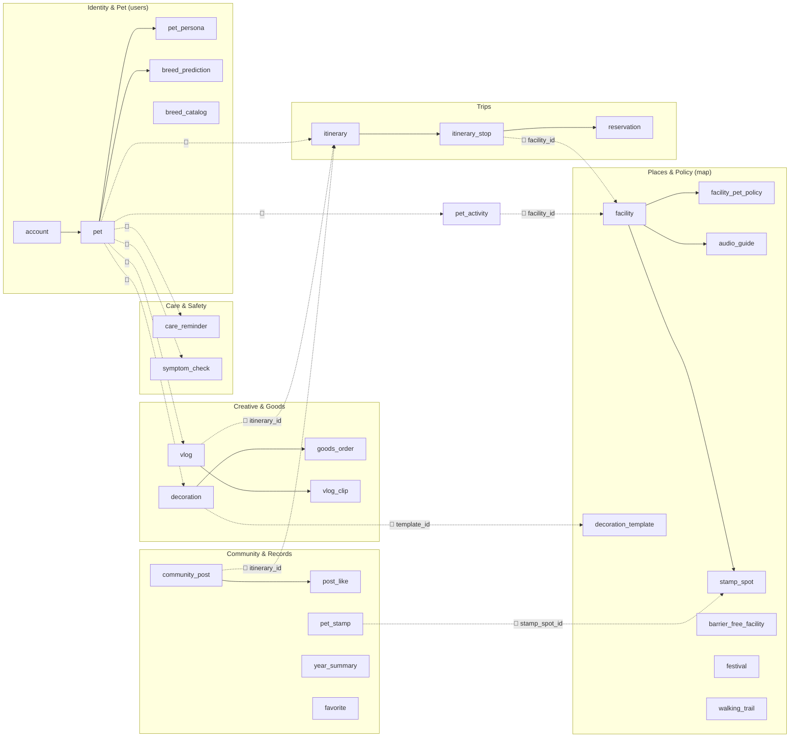

# 발자국(Baljaguk) — 전체 기능 통합 ERD

> HTML 프로토타입(`발자국 AI 반려동물 여행 플래너.html`)의 모든 화면(A1~H5)을 기준으로 도출한 데이터 모델.
> 초기 구현 스키마(13개 테이블, 마이그레이션 `96a7fd767f47`·`b7e2c9a4d1f3`)의 컨벤션·해설을 계승하고, D~H 기능에 필요한 신규 엔티티를 **제안**으로 확장한다.
> 구현·제안·예정을 **하나의 통합 ERD(§2)** 로 합쳐 그렸다.

**범례**
- 박스 제목은 `영문 테이블명 · 한글 [상태]` (영문 = 실제/예정 DB 테이블명)
- **상태**: `[구현]` = 초기 마이그레이션(`96a7fd767f47`·`b7e2c9a4d1f3`)에 존재 · `[제안]` = HTML 근거로 추가(데모는 CSV/Mock, 풀 3NF DB 단계 적재) · `[예정]` = 초기 설계의 미구현 시설 소셜(즐겨찾기·리뷰) 보존
- **실선(`--`) = 식별 관계**: 부모 FK가 자식 PK의 일부(자식이 부모 없이 존재 불가)
- **점선(`..`) = 비식별 관계**: FK가 자식의 일반 컬럼
- 까마귀발: `||` 정확히 1 · `|o` 0 또는 1 · `o{` 0 이상 · `|{` 1 이상
- **🔗 논리 참조**: 다른 컨텍스트의 PK를 의미상 참조하나 **FK 미선언**(`pet_activity.facility_id` 패턴). 통합 ERD에서는 가독성을 위해 점선 관계선으로 그리되 라벨에 🔗를 붙여 FK 미선언임을 표시. 실제 미선언 목록은 §4 참조맵.
- 파생 read 모델(`entry_verdict`·`policy_card`·`route_planner`·`safety_alert`)은 테이블이 없어 제외(입장 판정·배지는 런타임 규칙)

---

## 1. 화면(A~H) → 엔티티 매핑

| 화면 | 기능 | 주요 엔티티 |
|---|---|---|
| **A1~A4** | 시작·사진·견종 인식(ML) | `account`, `pet`, `breed_catalog`, `breed_catalog_trait`, **`breed_prediction`** |
| **A5~A6** | 프로필 입력·자동 분류 | `pet`, `pet_trait` |
| **B1~B3** | 페르소나·실사 히어로·특징 편집 | `pet`, `pet_trait`, **`pet_persona`** |
| **C1~C2** | AI 프롬프트·추천 코스 | **`itinerary`**, **`itinerary_stop`** 🔗 `facility` |
| **C3~C5** | 시설 상세·입장 판정·배지 | `facility`, `facility_pet_policy`, `facility_allowed_pet_size` *(배지=런타임)* |
| **C6** | 발자국 지도·동선 | `itinerary_stop`(seq) |
| **C7~C9** | 무장애 토글·배려 시설 | `barrier_free_facility`, `barrier_free_feature` |
| **C10~C11** | 식당·숙소 예약(mock) | **`reservation`** 🔗 `facility` |
| **C12** | 닮은 친구 추천(코호트) | `pet_activity` *(런타임 집계)* |
| **D1~D2** | 케어 타임라인·알림 | **`care_reminder`** |
| **D3~D5** | QR·오디오 가이드 | **`audio_guide`** 🔗 `facility` |
| **D6~D9** | 응급 증상 체크(참고용) | **`symptom_check`** |
| **D10~D11** | 가까운 병원 | `facility`(category=동물병원) *(영업시간=mock)* |
| **E1~E2** | 축제 캘린더·리스트 | **`festival`** |
| **E3** | 걷기 코스(두루누비) | **`walking_trail`** |
| **E4** | 스탬프 컬렉션 | **`stamp_spot`**, **`pet_stamp`** |
| **F1~F9** | 꾸미기(한복)·3D 리빌 | **`decoration_template`**, **`decoration`** |
| **F10** | 저장·공유·굿즈(mock) | **`goods_order`** |
| **G1~G5** | 강아지 시점 브이로그 | **`vlog`**, **`vlog_clip`** |
| **H1~H2** | 커뮤니티·코스 후기·담기 | **`community_post`**, **`post_like`** 🔗 `itinerary` |
| **H3** | 발자국 클립 | `vlog` |
| **H4** | 펫 패스포트 | *(집계 뷰: `pet_activity`+`pet_stamp`+`year_summary`)* |
| **H5** | 연말 결산·발자국 지도 | **`year_summary`** |

---

## 2. 통합 ERD (전체 한 장)

구현(13)·제안(20)·예정(2) 전 엔티티를 하나의 ERD로 통합. 박스 제목 끝 `[구현]`/`[제안]`/`[예정]`으로 상태를 구분하고, 컨텍스트 경계를 넘는 참조(🔗)는 점선으로 이어 전 엔티티가 한 장에 연결되게 했다(FK는 §4대로 미선언).

```mermaid
erDiagram
    %% ════════ [구현] 공유 차원 ════════
    region["region · 지역 [구현]"] {
        int id PK "지역 ID"
        string name "지역명"
        int level "1=시도 2=시군구"
        int parent_id FK "상위 지역(nullable)"
    }
    category["category · 분류 [구현]"] {
        int id PK "분류 ID"
        string name "분류명"
        int level "1=대 2=중 3=소"
        int parent_id FK "상위 분류(nullable)"
    }
    %% ════════ [구현] 시설(map) ════════
    facility["facility · 시설 [구현]"] {
        int id PK "시설 ID"
        string name "시설명"
        float latitude "위도"
        float longitude "경도"
        int region_id FK "지역(nullable)"
        int category_id FK "분류(nullable)"
        string road_address "도로명주소"
        string jibun_address "지번주소"
        string phone "전화번호"
        string operating_hours "운영시간"
        string homepage "예약/홈페이지 URL"
    }
    facility_pet_policy["facility_pet_policy · 반려동물 정책 [구현]"] {
        int facility_id PK,FK "시설"
        bool companion_allowed "동반 가능"
        string restriction "제한사항"
        string extra_fee "추가 요금"
        bool indoor "실내 여부"
        bool outdoor "실외 여부"
    }
    facility_allowed_pet_size["facility_allowed_pet_size · 허용 크기 [구현]"] {
        int facility_id PK,FK "시설"
        string pet_size PK "허용 크기"
    }
    barrier_free_facility["barrier_free_facility · 이동약자 배려시설 [구현]"] {
        int id PK "시설 ID"
        string name "시설명"
        float latitude "위도"
        float longitude "경도"
        int region_id FK "지역(nullable)"
        int category_id FK "분류(nullable)"
        string road_address "도로명주소"
    }
    barrier_free_feature["barrier_free_feature · 배려 요소 [구현]"] {
        int facility_id PK,FK "시설"
        string feature_code PK "배려 요소 코드"
    }
    %% ════════ [구현] 사용자/반려동물(users) ════════
    account["account · 회원 계정 [구현]"] {
        int id PK "회원 ID"
        string email UK "이메일(고유)"
        string password_hash "비밀번호 해시"
        string nickname "닉네임"
        datetime created_at "가입일시"
    }
    pet["pet · 반려동물 [구현]"] {
        int id PK "반려동물 ID"
        int account_id FK "회원"
        string breed "견종(🔗 breed_catalog)"
        string name "이름"
        string photo_url "사진 URL"
        string size "크기(개체값)"
        string temperament "기질(개체값)"
        int birth_year "출생연도(nullable)"
        string gender "성별"
        string features "특징(자유서술 nullable)"
    }
    pet_trait["pet_trait · 반려동물 체질 [구현]"] {
        int pet_id PK,FK "반려동물"
        string trait PK "체질"
    }
    breed_catalog["breed_catalog · 견종 표준정보 [구현]"] {
        string breed PK "견종(정규화 키)"
        string display_name "표시명(nullable)"
        string size "표준 크기"
        string temperament "표준 기질"
    }
    breed_catalog_trait["breed_catalog_trait · 견종 체질 [구현]"] {
        string breed PK,FK "견종"
        string trait PK "체질"
    }
    pet_activity["pet_activity · 행동 로그 [구현]"] {
        int id PK "행동 ID"
        int pet_id FK "반려동물(코호트 단위)"
        int facility_id "시설(🔗 facility, FK 미선언)"
        string action_type "행동 유형(방문/저장)"
        datetime occurred_at "발생 시각"
    }

    %% ════════ [제안] Identity 확장 — A·B ════════
    breed_prediction["breed_prediction · 견종 인식 후보 [제안]"] {
        int id PK "후보 ID"
        int pet_id FK "반려동물"
        string candidate_breed "후보 견종(🔗 breed_catalog)"
        float similarity "유사도 0~1(닮은 친구 %)"
        int rank "순위 · uniq(pet_id,rank)"
    }
    pet_persona["pet_persona · 페르소나 [제안]"] {
        int pet_id PK,FK "반려동물"
        string intro_text "자기소개(LLM)"
        string hero_image_url "실사 히어로"
        string mascot_image_url "마스코트안"
        string tone "말투"
        datetime created_at "생성일시"
    }

    %% ════════ [제안] Trips — C 핵심 ════════
    itinerary["itinerary · 추천 코스 [제안]"] {
        int id PK "코스 ID"
        int pet_id "반려동물(🔗 pet)"
        string title "코스명(멍품 코스)"
        int region_id "지역(🔗 region)"
        string prompt_text "AI 한 줄 입력(C1)"
        bool is_saved "저장 여부"
        datetime created_at "생성일시"
    }
    itinerary_stop["itinerary_stop · 동선 경유지 [제안]"] {
        int itinerary_id PK,FK "코스"
        int seq PK "방문 순서"
        int facility_id "시설(🔗 facility)"
        string transport "도보/차량"
        float distance_from_prev_km "직전 경유지 거리"
        string note "그늘길/물그릇 등"
    }
    reservation["reservation · 예약(mock) [제안]"] {
        int id PK "예약 ID"
        int itinerary_id FK "코스(복합 FK→stop)"
        int seq FK "경유지 순서(복합 FK→stop)"
        int pet_id "반려동물(🔗 pet)"
        string type "restaurant/lodging"
        int party_size "인원"
        string price "금액(mock)"
        string status "상태(mock)"
        datetime reserved_at "예약일시"
    }

    %% ════════ [제안] Places 마스터 — D·E·F ════════
    audio_guide["audio_guide · 오디오 가이드 [제안]"] {
        int id PK "가이드 ID"
        int facility_id FK "시설"
        string language "언어(ko)"
        string script_text "각색 대본(LLM)"
        string audio_url "TTS(강아지 목소리)"
    }
    stamp_spot["stamp_spot · 스탬프 대상 [제안]"] {
        int id PK "스탬프 ID"
        int facility_id FK "시설"
        int region_id FK "지역(nullable)"
        string name "스탬프명"
        string theme "테마"
    }
    festival["festival · 축제 [제안]"] {
        int id PK "축제 ID"
        int region_id FK "지역(nullable)"
        string name "축제명"
        date start_date "시작일"
        date end_date "종료일"
        bool pet_allowed "반려동물 동반"
        string source "출처"
    }
    walking_trail["walking_trail · 걷기길 [제안]"] {
        int id PK "코스 ID"
        int region_id FK "지역(nullable)"
        string name "코스명"
        float distance_km "거리"
        string difficulty "난이도"
        string duration "소요시간"
        string path_geojson "경로 좌표(GeoJSON)"
        string description "설명"
    }
    decoration_template["decoration_template · 꾸미기 템플릿 [제안]"] {
        int id PK "템플릿 ID(독립 마스터)"
        string name "이름(전통 한복 등)"
        string theme "전통/계절/여행지"
        string thumbnail_url "썸네일"
        string source "출처(전통복식 AI)"
    }

    %% ════════ [제안] Care & Safety — D ════════
    care_reminder["care_reminder · 케어 알림 [제안]"] {
        int id PK "알림 ID"
        int pet_id FK "반려동물"
        string type "feed/water/rest"
        int interval_min "급여/휴식 간격(분)"
        string scheduled_time "예정 시각"
        bool enabled "활성 여부"
    }
    symptom_check["symptom_check · 증상 체크 [제안]"] {
        int id PK "체크 ID"
        int pet_id FK "반려동물"
        string photo_url "증상 첨부(D7)"
        string symptom_text "증상 서술"
        string ai_result_text "참고 분석(D9)"
        string severity "응급 신호 여부"
        bool is_diagnostic "항상 false(가드레일)"
        datetime created_at "생성일시"
    }

    %% ════════ [제안] Creative & Goods — F·G ════════
    decoration["decoration · 꾸미기 결과 [제안]"] {
        int id PK "결과 ID"
        int pet_id FK "반려동물"
        int template_id "템플릿(🔗 decoration_template)"
        string source_photo_url "원본 사진"
        string result_image_url "AI 결과(F3)"
        string model3d_url "3D 리빌(F8)"
        datetime created_at "생성일시"
    }
    goods_order["goods_order · 굿즈 주문(mock) [제안]"] {
        int id PK "주문 ID"
        int decoration_id FK "꾸미기 결과"
        int pet_id "반려동물(🔗 pet)"
        string product_type "figure 등"
        string status "상태(mock)"
        datetime ordered_at "주문일시"
    }
    vlog["vlog · 브이로그 [제안]"] {
        int id PK "브이로그 ID"
        int pet_id FK "반려동물"
        int itinerary_id "코스(🔗 itinerary)"
        string tone "톤(G3)"
        string video_url "영상 URL"
        datetime created_at "생성일시"
    }
    vlog_clip["vlog_clip · 클립 [제안]"] {
        int vlog_id PK,FK "브이로그"
        int seq PK "클립 순서"
        string source_type "photo/video"
        string media_url "미디어 URL"
    }

    %% ════════ [제안] Community & Records — E4·H ════════
    community_post["community_post · 코스 후기 [제안]"] {
        int id PK "글 ID"
        int account_id FK "회원"
        int pet_id "반려동물(🔗 pet)"
        int itinerary_id "코스(🔗 itinerary)"
        string title "제목"
        string body "내용"
        datetime created_at "작성일시"
    }
    post_like["post_like · 담기/좋아요 [제안]"] {
        int post_id PK,FK "글"
        int account_id PK "회원(🔗 account)"
    }
    pet_stamp["pet_stamp · 수집 스탬프 [제안]"] {
        int pet_id PK,FK "반려동물"
        int stamp_spot_id PK "스탬프(🔗 stamp_spot)"
        datetime collected_at "수집일시"
    }
    year_summary["year_summary · 연말 결산 [제안]"] {
        int id PK "결산 ID"
        int pet_id FK "반려동물"
        int year "연도 · uniq(pet_id,year)"
        float total_distance_km "총 이동거리"
        int places_count "방문 장소 수"
        string story_text "결산 스토리(LLM)"
        datetime created_at "생성일시"
    }

    %% ════════ [예정] 시설 단위 소셜 ════════
    favorite["favorite · 즐겨찾기 [예정]"] {
        int account_id PK,FK "회원"
        int facility_id PK,FK "시설"
        datetime created_at "추가일시"
    }
    review["review · 리뷰 [예정]"] {
        int id PK "리뷰 ID"
        int account_id FK "회원"
        int facility_id FK "시설"
        int rating "평점(1~5)"
        string comment "내용"
        datetime created_at "작성일시"
    }

    %% ──────── 관계: 공유 차원 자기참조(비식별) ────────
    region   |o..o{ region   : "상위↔하위 구역"
    category |o..o{ category : "상위↔하위 분류"

    %% ──────── 관계: [구현] 시설/사용자/견종 ────────
    region   |o..o{ facility : "위치"
    category |o..o{ facility : "분류"
    region   |o..o{ barrier_free_facility : "위치"
    category |o..o{ barrier_free_facility : "분류"
    facility ||--o| facility_pet_policy : "정책 1:1"
    facility ||--o{ facility_allowed_pet_size : "허용 크기"
    barrier_free_facility ||--o{ barrier_free_feature : "배려 요소"
    account       ||..o{ pet : "보유"
    breed_catalog ||..o{ pet : "🔗 견종(미강제 FK)"
    pet           ||--o{ pet_trait : "체질"
    breed_catalog ||--o{ breed_catalog_trait : "기질"
    pet      ||..o{ pet_activity : "행동 기록"
    facility ||..o{ pet_activity : "🔗 facility_id"

    %% ──────── 관계: [제안] Identity ────────
    pet           ||..o{ breed_prediction : "인식 후보(A4)"
    breed_catalog ||..o{ breed_prediction : "🔗 candidate_breed"
    pet           ||--o| pet_persona : "페르소나 1:1(B)"

    %% ──────── 관계: [제안] Trips ────────
    pet      ||..o{ itinerary : "🔗 pet_id(소유)"
    region   |o..o{ itinerary : "🔗 region_id"
    itinerary     ||--o{ itinerary_stop : "동선 순서(C6)"
    facility ||..o{ itinerary_stop : "🔗 facility_id"
    itinerary_stop ||..o{ reservation : "예약(C10/C11)"
    pet      ||..o{ reservation : "🔗 pet_id"

    %% ──────── 관계: [제안] Places 마스터 ────────
    facility ||..o{ audio_guide : "오디오(D4)"
    facility ||..o{ stamp_spot : "스탬프 대상(E4)"
    region   |o..o{ stamp_spot : "위치"
    region   |o..o{ festival : "축제(E)"
    region   |o..o{ walking_trail : "걷기길(E)"

    %% ──────── 관계: [제안] Care & Safety ────────
    pet ||..o{ care_reminder : "케어 알림(D2)"
    pet ||..o{ symptom_check : "증상 체크(D6~D9)"

    %% ──────── 관계: [제안] Creative & Goods ────────
    pet                 ||..o{ decoration : "꾸미기(F3)"
    decoration_template ||..o{ decoration : "🔗 template_id"
    decoration          ||..o{ goods_order : "굿즈 주문(F10)"
    pet                 ||..o{ goods_order : "🔗 pet_id"
    pet       ||..o{ vlog : "브이로그(G)"
    itinerary ||..o{ vlog : "🔗 itinerary_id"
    vlog      ||--o{ vlog_clip : "클립(G2)"

    %% ──────── 관계: [제안] Community & Records ────────
    account        ||..o{ community_post : "코스 후기(H1)"
    pet            ||..o{ community_post : "🔗 pet_id"
    itinerary      ||..o{ community_post : "🔗 itinerary_id"
    community_post ||--o{ post_like : "담기/좋아요(H2)"
    account        ||..o{ post_like : "🔗 account_id"
    pet            ||--o{ pet_stamp : "스탬프 수집(E4)"
    stamp_spot     ||..o{ pet_stamp : "🔗 stamp_spot_id"
    pet            ||..o{ year_summary : "연말 결산(H5)"

    %% ──────── 관계: [예정] 시설 단위 소셜 ────────
    account  ||--o{ favorite : "즐겨찾기(예정)"
    facility ||--o{ favorite : "(예정)"
    account  ||..o{ review : "리뷰 작성(예정)"
    facility ||..o{ review : "(예정)"
```

> **상태 한눈에**: `[구현]` 13개 · `[제안]` 20개 · `[예정]` 2개 = 35개 엔티티. 데모는 `[구현]`(Neon DB)+`[제안]`(CSV/Mock)으로 끝까지 돌고, 풀 3NF DB 단계에서 `[제안]`을 테이블로 승격, `[예정]`은 시설 소셜 확장 시 추가.

---

## 3. 통합 관계 개요 (컨텍스트 그룹 뷰)

§2가 컬럼 수준 통합본이라면, 아래는 컨텍스트 묶음과 cross-context 🔗만 추린 조감도.

---

## 4. Cross-context 논리 참조 맵 (FK 미선언)

기존 `pet_activity.facility_id` 패턴을 따라, 컨텍스트 경계를 넘는 참조는 FK를 걸지 않고 인덱스만 둔다. 무결성은 애플리케이션 계층에서 보장. (§2 통합 ERD에서는 점선 + 🔗 라벨로 그렸으나, 실제 DB FK 제약은 아래 전부 **미선언**.)

| 참조 주체 | 컬럼 | 의미상 대상 | 근거 |
|---|---|---|---|
| `pet_activity` *(구현됨)* | `facility_id` | `facility.id` | 코호트 추천(C12) |
| `pet` *(구현됨)* | `breed` | `breed_catalog.breed` | 견종 자동분류(A5) |
| `breed_prediction` | `candidate_breed` | `breed_catalog.breed` | 인식 후보(A4) |
| `itinerary` | `pet_id`, `region_id` | `pet.id`, `region.id` | 코스 소유·지역 |
| `itinerary_stop` | `facility_id` | `facility.id` | 동선(C6) |
| `reservation` | `pet_id` | `pet.id` | 예약(C10/C11) |
| `decoration` | `template_id` | `decoration_template.id` | 꾸미기(F) |
| `goods_order` | `pet_id` | `pet.id` | 굿즈(F10) |
| `vlog` | `itinerary_id` | `itinerary.id` | 브이로그(G) |
| `community_post` | `pet_id`, `itinerary_id` | `pet.id`, `itinerary.id` | 후기(H) |
| `post_like` | `account_id` | `account.id` | 담기/좋아요(H2) — junction cross-context leg |
| `pet_stamp` | `stamp_spot_id` | `stamp_spot.id` | 스탬프(E4) — junction cross-context leg |

---

## 5. 이 ERD를 이렇게 그린 이유 (설계 해설)

초기 구현 스키마의 해설(1~9)을 계승하고, HTML 전체 기능 확장분(10~14)을 덧붙인다.

1. **컨텍스트 4묶음 + 확장**: 공유 차원(`region`·`category`) / 시설(`facility` 계열) / 사용자·반려동물(`account`·`pet`) / 견종(`breed_catalog`)이 헥사고날 슬라이스(map·users)와 1:1. 신규 기능은 `trips`·`care`·`creative`·`community` 컨텍스트 후보로 추가.
2. **`region`·`category` 공유 차원**: `facility`와 `barrier_free_facility`(+신규 `festival`·`walking_trail`·`stamp_spot`)가 같은 지역·분류 축을 써, "전주의 카페"·"전주의 축제"를 같은 필터로 처리. 차원 복제 없음.
3. **자기참조 계층**: `region`(시도→시군구), `category`(대→중→소)를 한 테이블의 `parent_id`로. 깊이가 늘어도 스키마 불변.
4. **다중값 분리(3NF)**: `facility_allowed_pet_size`·`barrier_free_feature`·`pet_trait`·`breed_catalog_trait`·신규 `vlog_clip` — 반복 값을 별도 테이블로, 부모 키가 자기 PK의 일부(식별 실선).
5. **`facility_pet_policy` 1:1 분리**: 기본정보와 반려동물 정책의 변경 주기·관심사 분리.
6. **`facility`/`barrier_free_facility` 비통합**: 출처가 다른 별개 공공데이터. 차원만 공유, 본체 분리.
7. **견종이 아닌 "실제 특징" 중심**: `breed_catalog`는 입력 자동완성 소스, 실제 특징은 `pet`에 저장(혼종견 override). `pet.size`/`temperament`가 겹쳐도 이행 종속 미성립 → 3NF.
8. **식별/비식별·까마귀발 구분**: 선만 보고 "부모 없이 존재 가능한가"·"몇 개와 연결되나"를 읽게 함. nullable FK는 부모쪽 `|o`로 공공데이터 누락 반영.
9. **코호트 소셜은 pet 단위**: `pet_activity`가 코호트 연료. 한 계정이 소형견+대형견을 키우면 다른 코호트라 `account`가 아닌 `pet`에 묶음.
10. **코스(`itinerary`)를 별도 컨텍스트로**: `POST /trips/plan` 산출물. `itinerary_stop`은 `(itinerary_id, seq)` 복합 PK로 순서를 자연키화(식별). 시설은 cross-context라 🔗 논리 참조.
11. **테이블 미신설(파생/집계)**: 입장 판정·배지(C4/C9)는 `facility_pet_policy`+`pet.size`/`pet_trait`로 **런타임 규칙**(안전·규정은 AI 아닌 규칙 — 가드레일). 펫 패스포트(H4)·발자국 지도는 `pet_activity`+`pet_stamp`+`year_summary` 집계 뷰. 포토카드·공유카드(G4/G5)는 `vlog`/`decoration` 산출물의 표현이라 별도 테이블 없음.
12. **응급 가드레일을 스키마에 박음**: `symptom_check.is_diagnostic`을 항상 `false`로 둬 "진단 아님"을 데이터 모델에서 강제.
13. **생성형 산출물의 재현성**: `pet_persona`·`decoration`·`vlog`·`year_summary`는 입력·결과 URL을 함께 저장해 재생성 없이 재현.
14. **외부 데이터 캐시 마스터**: `audio_guide`·`festival`·`walking_trail`·`stamp_spot`은 공공데이터(오디오가이드/지역축제/두루누비/지역문화) 적재분, `decoration_template`은 전통복식 AI 데이터의 독립 마스터. `source` 컬럼으로 출처 태그 유지.

---

## 6. 테이블 한국어 대응표

| 테이블 | 한국어 | 상태 | 설명 |
|---|---|---|---|
| `region` | 지역 | 구현 | 시도→시군구 자기참조 계층 |
| `category` | 분류 | 구현 | 카페·박물관·캠핑 등 대→중→소 |
| `facility` | 시설 | 구현 | 반려동물 동반 가능 시설(+동물병원) |
| `facility_pet_policy` | 시설 반려동물 정책 | 구현 | 동반·제한·요금·실내외(1:1) |
| `facility_allowed_pet_size` | 시설 허용 크기 | 구현 | 입장 가능 크기(다중값) |
| `barrier_free_facility` | 이동약자 배려시설 | 구현 | 무장애 문화·관광지(별도 출처) |
| `barrier_free_feature` | 이동약자 배려 요소 | 구현 | 휠체어·점자 등(다중값) |
| `account` | 회원 계정 | 구현 | 이메일·닉네임·해시 |
| `pet` | 반려동물 | 구현 | 회원이 등록한 반려견 |
| `pet_trait` | 반려동물 체질 | 구현 | 단두종 등 개체 체질(다중값) |
| `breed_catalog` | 견종 표준정보 | 구현 | 표준 크기·기질·표시명(자동완성) |
| `breed_catalog_trait` | 견종 체질 | 구현 | 견종별 표준 체질(다중값) |
| `pet_activity` | 반려동물 행동 로그 | 구현 | 방문/저장 누적 → 코호트 연료 |
| `breed_prediction` | 견종 인식 후보 | 제안 | A4 닮은 친구 % 후보(1:N) |
| `pet_persona` | 페르소나 | 제안 | B 자기소개·실사 히어로(1:1) |
| `itinerary` | 추천 코스 | 제안 | C `/trips/plan` 산출 코스 |
| `itinerary_stop` | 동선 경유지 | 제안 | C6 시설 방문 순서(식별) |
| `reservation` | 예약 | 제안 | C10/C11 식당·숙소(mock) |
| `audio_guide` | 오디오 가이드 | 제안 | D4 관광지 각색 대본·TTS |
| `symptom_check` | 증상 체크 | 제안 | D6~D9 응급 참고용(진단 아님) |
| `care_reminder` | 케어 알림 | 제안 | D2 급여·물·휴식 알림 |
| `festival` | 축제 | 제안 | E1/E2 지역축제 캘린더 |
| `walking_trail` | 걷기길 | 제안 | E3 두루누비 코스 |
| `stamp_spot` | 스탬프 대상 | 제안 | E4 문화시설 스탬프 |
| `pet_stamp` | 수집 스탬프 | 제안 | E4 펫이 모은 스탬프(식별) |
| `decoration_template` | 꾸미기 템플릿 | 제안 | F1/F4 한복·계절 갤러리(독립 마스터) |
| `decoration` | 꾸미기 결과 | 제안 | F3 AI 결과·3D |
| `goods_order` | 굿즈 주문 | 제안 | F10 피규어 주문(mock) |
| `vlog` | 브이로그 | 제안 | G 강아지 시점 영상 |
| `vlog_clip` | 클립 | 제안 | G2 영상 클립(다중값) |
| `community_post` | 코스 후기 | 제안 | H1/H2 커뮤니티 코스 공유 |
| `post_like` | 담기/좋아요 | 제안 | H2 후기 좋아요(식별) |
| `year_summary` | 연말 결산 | 제안 | H5 결산 스토리·지도 |
| `favorite` | 즐겨찾기 | 예정 | 회원↔시설 북마크(기존 설계) |
| `review` | 리뷰 | 예정 | 회원↔시설 평점(기존 설계) |

---

## 7. 정규화 검증 메모

**3NF 확인 (정상)**
- **다중값 분리**: `*_allowed_pet_size`·`*_feature`·`pet_trait`·`breed_catalog_trait`·`vlog_clip`·`pet_stamp` — 반복 그룹을 별도 테이블로, 순수 연관 테이블.
- **계층 차원**: `region`·`category` 자기참조, 다수 시설/축제/걷기길이 공유.
- **1:1 분리**: `facility_pet_policy`(시설 수직 분할), `pet_persona`(생성형 산출물).

**식별/비식별 관계 검증**
- 식별(실선): `*_pet_policy`·`*_allowed_pet_size`·`*_feature`·`pet_trait`·`breed_catalog_trait`·`itinerary_stop`·`vlog_clip`·`post_like`·`pet_stamp`·`favorite` — FK가 자식 PK에 포함.
- 비식별(점선): 자기참조, `→facility`/`→barrier_free_facility`, `account→pet`, `breed_catalog→pet`, `→pet_activity`, `pet→{breed_prediction,care_reminder,symptom_check,decoration,vlog,year_summary}`, `→reservation`, `→goods_order`, `account→community_post`, `→review`, 마스터→{audio_guide,stamp_spot,festival,walking_trail} — FK가 일반 컬럼.

**junction(다대다) 테이블의 🔗 규칙 (통합 ERD 선 종류 결정)**
- `post_like`·`pet_stamp`처럼 PK가 두 부모 키의 복합인 연관 테이블은, **한쪽 leg만 in-context 실 FK(실선)**, 나머지 cross-context leg는 PK에 포함되더라도 **FK 미선언 🔗(점선)** 으로 둔다. cross-context FK 미선언 규칙(§4)이 식별 관계보다 우선하기 때문.
  - `pet_stamp`: `pet_id` = 실선(users 내 실 FK) · `stamp_spot_id` = 🔗(map 컨텍스트 cross, §4).
  - `post_like`: `post_id` = 실선(community 내 실 FK) · `account_id` = 🔗(users 컨텍스트 cross, §4).
  - `favorite`는 `account`·`facility`를 한 묶음에서 다루는 시설 소셜이라 양쪽 실선(예외 없음).

**까마귀발 검증 (nullable 반영)**
- nullable FK → 부모측 `|o`: `facility/barrier_free_facility.region_id·category_id`, `region/category.parent_id`, `stamp_spot/festival/walking_trail.region_id`, `itinerary.region_id`.
- NOT NULL FK → 부모측 `||`: `pet.account_id`, `pet_trait.pet_id`, 신규 자식의 부모 FK 등.

**유니크 제약 (제안 테이블 보강)**
- `year_summary(pet_id, year)` UNIQUE: 한 펫의 한 해 결산은 1행 — 중복 결산 방지.
- `breed_prediction(pet_id, rank)` UNIQUE: 한 펫의 인식 후보 순위는 유일 — 동일 순위 중복 방지.
- `pet_activity`·`reservation` 등 로그성 테이블은 surrogate `id`만 두고 유니크 비강제(이력 누적).

**`pet.size`/`pet.temperament` 3NF 판정 → 위반 아님 (확정)**
- `breed → size`가 강제되지 않음(혼종견·개체 override) → 이행 종속 미성립 → 3NF 충족.
- `breed_catalog` = 자동완성 소스, `pet` = 개체의 실제 특징(코호트 키).

**코호트 기반 추천 (기획 핵심)**
- 코호트 키 = `pet.size`·`pet.temperament`·`pet_trait.trait`, 행동 신호 = `pet_activity`(pet 단위).
- 집계: `pet_activity ⋈ pet ⋈ pet_trait` → 코호트 필터 → `facility` GROUP BY 인기순(C12 닮은 친구).

**3NF 예외 — 의도적 비정규화·이행종속 (사유 기록)**
구현 13개는 전부 3NF. 아래는 제안 테이블 중 **엄격 3NF를 일부러 완화했거나 이행종속 소지가 있는 항목**이며, 모두 데모 단순화·재현성·조회 편의를 위한 의도된 결정이다(풀 3NF DB 단계에서 재검토).
- **`walking_trail.path_geojson` (1NF 완화)**: 경로 좌표 다중값을 GeoJSON 단일 컬럼에 보관. 좌표 1점=1행 분리(`walking_trail_point`)는 과정규화라 트레이드오프상 단일 컬럼 유지. 경로 분석이 필요해지면 분리.
- **`stamp_spot.region_id` (이행종속 소지)**: `facility_id`가 있으면 지역은 `facility`를 경유해 결정되므로 `region_id` 직접 보관은 이행종속. **정당화**: `facility`에 매칭 안 되는 스탬프(지역 행사 등)도 허용하려 `facility_id`·`region_id` 둘 다 nullable로 둠. `facility_id`가 있을 때 `region_id`는 그 시설 지역과 일치시켜 채움(앱 계층 보장).
- **`goods_order.pet_id` (이행종속 — 편의 비정규화)**: `decoration_id`가 `pet`을 결정(`decoration→pet`)하므로 `pet_id`는 중복. **정당화**: 굿즈 목록을 펫 단위로 바로 조회하기 위한 비정규화. 엄격 3NF가 필요하면 `pet_id` 제거 후 `decoration` 경유 조회.
- **`vlog.pet_id`·`community_post.pet_id` (경계 케이스 — 위반 아님)**: `itinerary_id` 경유로 pet이 결정될 수 있으나 `itinerary_id`가 nullable(코스 없는 브이로그·자유글 허용)이라 pet을 직접 보관해야 함 → 이행종속 미성립.
- **`year_summary.total_distance_km`·`places_count` (유도속성 스냅샷)**: `pet_activity`/`pet_stamp` 집계로 계산 가능한 값. **정당화**: 연말 결산은 시점 고정 스냅샷이라 재계산 없이 보존(§5 해설 13 재현성).

**⚠️ 검토 필요 사항**
1. **cross-context FK 미강제**: `pet.breed`·`itinerary_stop.facility_id`·`pet_activity.facility_id` 등은 자유 FK(§4). ERD는 논리 참조로 그렸으나 DB 제약 없음 → 애플리케이션 계층 무결성 보강.
2. **`pet.features`(자유서술) vs `pet_trait`(정규화)**: features에 구분자 나열 시 1NF 반복그룹 소지. 추천은 정규화 `pet_trait`만 사용.
3. **`walking_trail.path_geojson`**: 경로 좌표를 단일 컬럼 보관(과정규화 회피). 경로 분석이 필요해지면 `walking_trail_point(trail_id, seq, lat, lng)`로 분리.
4. **`reservation`의 복합 FK 표기**: 실제 FK는 `(itinerary_id, seq) → itinerary_stop` 복합키. 통합 ERD에선 두 컬럼을 각각 FK로 마킹했으나 의미는 복합 1건.
5. **mock 영역**: `reservation`·`goods_order`는 결제/예약 미구현(사업화 슬라이드용). 실서비스 전환 시 트랜잭션·상태 컬럼 보강.

---

*근거: `발자국 AI 반려동물 여행 플래너.html`(A1~H5), `발자국_PROJECT_CONTEXT.md`, 초기 마이그레이션 `96a7fd767f47`·`b7e2c9a4d1f3`(컨벤션·해설 계승).*
