# 발자국(adapdog) ERD

반려동물 동반 플랫폼 데이터 모델. 3NF 정규화 기준.

**범례**
- 박스 제목은 `영문 테이블명 · 한글` 형식 (영문 = 실제 DB 테이블명)
- **실선(`--`) = 식별 관계** : 부모 FK가 자식 PK의 일부 (자식이 부모 없이는 존재 불가)
- **점선(`..`) = 비식별 관계** : FK가 자식의 일반 컬럼
- 까마귀발: `||` 정확히 1 · `|o` 0 또는 1 · `o{` 0 이상 · `|{` 1 이상
- `(예정)` = 소셜 확장 테이블(`favorite`, `review`, `pet_activity`) — 설계만 확정, 미구현
- 파생 read 모델(`entry_verdict`·`policy_card`·`route_planner`·`safety_alert`)은 테이블이 없어 제외

```mermaid
erDiagram
    %% ───────────── 공유 차원 (자기참조 계층) ─────────────
    region["region · 지역"] {
        int id PK "지역 ID"
        string name "지역명"
        int level "단계(1=시도 2=시군구)"
        int parent_id FK "상위 지역(nullable)"
    }
    category["category · 분류(종류)"] {
        int id PK "분류 ID"
        string name "분류명"
        int level "단계(1=대 2=중 3=소)"
        int parent_id FK "상위 분류(nullable)"
    }

    %% ───────────── 시설 (map) ─────────────
    facility["facility · 시설"] {
        int id PK "시설 ID"
        string name "시설명"
        float latitude "위도"
        float longitude "경도"
        int region_id FK "지역(nullable)"
        int category_id FK "분류(nullable)"
        string road_address "도로명주소"
        string jibun_address "지번주소"
        string phone "전화번호"
        string operating_hours "운영시간"
        string homepage "예약/홈페이지 URL"
    }
    facility_pet_policy["facility_pet_policy · 반려동물 정책"] {
        int facility_id PK,FK "시설"
        bool companion_allowed "동반 가능 여부"
        string restriction "제한사항"
        string extra_fee "추가 요금"
        bool indoor "실내 여부"
        bool outdoor "실외 여부"
    }
    facility_allowed_pet_size["facility_allowed_pet_size · 허용 크기"] {
        int facility_id PK,FK "시설"
        string pet_size PK "허용 크기"
    }

    %% ───────────── 배리어프리 시설 (별도 출처) ─────────────
    barrier_free_facility["barrier_free_facility · 이동약자 배려시설"] {
        int id PK "시설 ID"
        string name "시설명"
        float latitude "위도"
        float longitude "경도"
        int region_id FK "지역(nullable)"
        int category_id FK "분류(nullable)"
        string road_address "도로명주소"
    }
    barrier_free_feature["barrier_free_feature · 이동약자 배려 요소"] {
        int facility_id PK,FK "시설"
        string feature_code PK "이동약자 배려 요소 코드"
    }

    %% ───────────── 사용자 / 반려동물 (users) ─────────────
    account["account · 회원 계정"] {
        int id PK "회원 ID"
        string email UK "이메일(고유)"
        string password_hash "비밀번호 해시"
        string nickname "닉네임"
        datetime created_at "가입일시"
    }
    pet["pet · 반려동물"] {
        int id PK "반려동물 ID"
        int account_id FK "회원"
        string breed "견종"
        string name "이름"
        string photo_url "사진 URL"
        string size "크기(개체값)"
        string temperament "기질(개체값)"
        int birth_year "출생연도(nullable)"
        string gender "성별"
        string features "특징(자유서술 nullable)"
    }
    pet_trait["pet_trait · 반려동물 체질"] {
        int pet_id PK,FK "반려동물"
        string trait PK "체질"
    }

    %% ───────────── 견종 카탈로그 ─────────────
    breed_catalog["breed_catalog · 견종 표준정보"] {
        string breed PK "견종(정규화 키)"
        string size "표준 크기"
        string temperament "표준 기질"
    }
    breed_catalog_trait["breed_catalog_trait · 견종 체질"] {
        string breed PK,FK "견종"
        string trait PK "체질"
    }

    %% ───────────── 소셜 확장 (예정) ─────────────
    favorite["favorite · 즐겨찾기 (예정)"] {
        int account_id PK,FK "회원"
        int facility_id PK,FK "시설"
        datetime created_at "추가일시"
    }
    review["review · 리뷰 (예정)"] {
        int id PK "리뷰 ID"
        int account_id FK "회원"
        int facility_id FK "시설"
        int rating "평점(1~5)"
        string comment "내용"
        datetime created_at "작성일시"
    }
    pet_activity["pet_activity · 행동로그 (예정)"] {
        int id PK "행동 ID"
        int pet_id FK "반려동물(코호트 단위)"
        int facility_id FK "시설"
        string action_type "행동 유형(방문/저장)"
        datetime occurred_at "발생 시각"
    }

    %% ───── 비식별 관계 (FK가 자식 PK에 미포함 → 점선 ..) ─────
    region   |o..o{ region   : "상위↔하위 구역"
    category |o..o{ category : "상위↔하위 분류"
    region   |o..o{ facility : "위치"
    category |o..o{ facility : "분류"
    region   |o..o{ barrier_free_facility : "위치"
    category |o..o{ barrier_free_facility : "분류"
    account       ||..o{ pet : "보유"
    breed_catalog ||..o{ pet : "견종 참조 (미강제 FK)"
    account  ||..o{ review : "리뷰 작성 (예정)"
    facility ||..o{ review : "(예정)"
    pet      ||..o{ pet_activity : "행동 기록 (예정)"
    facility ||..o{ pet_activity : "(예정)"

    %% ───── 식별 관계 (FK가 자식 PK의 일부 → 실선 --) ─────
    facility ||--o| facility_pet_policy : "정책 1:1"
    facility ||--o{ facility_allowed_pet_size : "허용 크기"
    barrier_free_facility ||--o{ barrier_free_feature : "이동약자 배려 요소"
    pet           ||--o{ pet_trait : "성향"
    breed_catalog ||--o{ breed_catalog_trait : "기질"
    account  ||--o{ favorite : "즐겨찾기 (예정)"
    facility ||--o{ favorite : "(예정)"
```

## 이 ERD를 이렇게 그린 이유 (설계 해설)

이 그래프는 **"반려동물 특징으로 묶인 사람들에게, 갈 만한 곳을 추천한다"**는 제품 목표를 데이터로 옮긴 결과다. 큰 결정마다 이유가 있다.

### 1. 4개 묶음 + 소셜 확장으로 나뉜 이유
- **공유 차원**(`region`·`category`): "어디에" "무슨 종류"인지를 모든 시설이 공통으로 쓰는 축
- **시설**(`facility` 계열): 반려동물이 갈 수 있는 장소와 그 정책·허용 크기
- **사용자/반려동물**(`account`·`pet` 계열): 누가, 어떤 특징의 반려동물을 키우는가
- **견종 카탈로그**(`breed_catalog` 계열): 견종 입력 시 특징을 채워주는 참조 데이터
- **소셜 확장(예정)**: 행동을 쌓아 추천을 만드는 부분
→ 이 묶음들은 헥사고날 슬라이스(map/users)와 1:1로 맞물려, 한 기능을 고쳐도 다른 기능에 안 번지게 한다.

### 2. `region`·`category`를 두 시설이 "공유"하는 이유 (별 모양 차원)
`facility`와 `barrier_free_facility`가 같은 `region`/`category`를 가리킨다. 지역·분류 기준을 한 곳에만 두면, "강릉의 카페"·"강릉의 이동약자 배려시설"을 **같은 필터 로직**으로 처리할 수 있다. 차원을 복제하지 않으니 데이터도 안 어긋난다.

### 3. `region`·`category`가 자기 자신과 연결된 이유 (자기참조 계층)
계층(시도→시군구, 대→중→소분류)을 **별도 테이블 없이 한 테이블**에 담는 표준 패턴(adjacency list)이다. `parent_id`가 같은 표의 `id`를 가리켜서 선이 자기 테이블로 되돌아온다. 깊이가 늘어도(2→3단계) 스키마를 안 바꿔도 된다.
- `|o`(상위 0~1개) — 최상위는 부모가 없어 `parent_id`가 nullable
- `o{`(하위 0~여러 개) — 한 분류 밑에 여러 하위

### 4. 특징·크기·요소를 "별도 테이블"로 뺀 이유 (다중값 분리 = 3NF)
한 시설이 허용하는 크기가 여러 개(소·중·대), 한 시설의 배려 요소가 여러 개(휠체어·점자…)다. 이런 **반복되는 값**을 한 칸에 `"소,중,대"`처럼 욱여넣으면 검색·집계가 깨진다. 그래서 `facility_allowed_pet_size`·`barrier_free_feature`·`pet_trait`·`breed_catalog_trait`로 분리했다. 이 표들은 **식별 관계(실선)** — 부모 없이는 존재 의미가 없어 부모 키가 자기 PK의 일부다.

### 5. `facility_pet_policy`를 `facility`에서 떼어낸 이유 (1:1 분리)
시설의 기본정보(이름·좌표)와 반려동물 정책(동반 가능·제한·요금)은 **변경 주기와 관심사가 다르다.** 정책만 따로 다루기 좋게 1:1로 분리했다.

### 6. `facility`와 `barrier_free_facility`를 합치지 않은 이유
컬럼은 닮았지만 **출처가 다른 별개 공공데이터**고, 뒤따르는 속성도 다르다(반려동물 정책 vs 이동약자 배려 요소). 억지로 합치면 한쪽에만 있는 컬럼이 늘 비게 된다. 차원(`region`/`category`)만 공유하고 본체는 분리했다.

### 7. 견종이 아니라 "반려동물의 실제 특징"을 중심에 둔 이유
추천 코호트는 *"이 반려동물이 실제로 가진 특징"*으로 정의된다. 그래서 `breed_catalog`는 입력 시 값을 **채워주는 소스**일 뿐, 실제 특징은 `pet`에 저장한다(혼종견·표준과 다른 개체는 직접 수정 가능). 이 때문에 `pet.size/temperament`가 `breed_catalog`와 값이 겹쳐도 3NF 위반이 아니다.

### 8. 식별/비식별·까마귀발을 구분해 그린 이유
선만 봐도 **"이 자식이 부모 없이 존재할 수 있는가"(실선=불가, 점선=가능)**, **"몇 개와 연결되나"(까마귀발)**를 읽을 수 있게 했다. nullable인 FK는 부모쪽을 `|o`(0 또는 1)로 그려, 지역·분류가 비어 있을 수 있는 현실(공공데이터 누락)을 그대로 반영한다.

### 9. 소셜 테이블(`favorite`·`review`·`pet_activity`)을 미리 그린 이유
적재된 시설·견종 데이터는 추천의 "재료"일 뿐, **"이런 특징의 반려동물이 어디에 갔다"**는 행동 기록이 있어야 추천이 돈다. 그 핵심이 `pet_activity`이며, 코호트가 반려동물 단위라 **account가 아니라 pet에** 묶었다(한 사람이 소형견+대형견을 키우면 다른 코호트). 지금 구현 전이지만, 데이터 모델이 이 목표와 어긋나지 않게 자리를 미리 잡아뒀다.

## 테이블 한국어 대응표

| 테이블 | 한국어 명칭 | 설명 |
|---|---|---|
| `region` | 지역(행정구역) | 시도→시군구 자기참조 계층 |
| `category` | 분류(종류) | 시설이 무슨 종류인지(카페·박물관·캠핑·숙박 등)를 대→중→소 단계로 나눔. 시설 검색·필터의 기준 |
| `facility` | 시설 | 반려동물 동반 가능 시설(문화시설·동물병원·캠핑·숙박) |
| `facility_pet_policy` | 시설 반려동물 정책 | 동반 가능여부·제한·요금·실내외 (1:1) |
| `facility_allowed_pet_size` | 시설 허용 크기 | 입장 가능 반려동물 크기 (다중값) |
| `barrier_free_facility` | 이동약자 배려시설 | 휠체어·점자 등 이동약자 편의를 갖춘 문화·관광지 (반려동물 시설과 별개 데이터원) |
| `barrier_free_feature` | 이동약자 배려 요소 | 휠체어·점자·장애인화장실 등 (다중값) |
| `account` | 회원 계정 | 이메일·닉네임·비밀번호 해시 |
| `pet` | 반려동물 | 회원이 등록한 반려견 |
| `pet_trait` | 반려동물 체질 | 단두종 등 개체 체질 (다중값) |
| `breed_catalog` | 견종 표준정보 | 견종별 표준 크기·기질 (자동완성 데이터원) |
| `breed_catalog_trait` | 견종 체질 | 견종별 표준 체질 (다중값) |
| `favorite` *(예정)* | 즐겨찾기 | 회원↔시설 북마크 (계정 단위 UX) |
| `review` *(예정)* | 리뷰 | 회원↔시설 평점·후기 (계정 단위 UX) |
| `pet_activity` *(예정)* | 반려동물 행동 로그 | 반려동물↔시설 방문·저장 누적 → **코호트 추천 연료** |

## 정규화 검증 메모

**3NF 확인 (정상)**
- **다중값 분리**: `facility_allowed_pet_size`·`barrier_free_feature`·`pet_trait`·`breed_catalog_trait` — 반복 그룹을 별도 테이블로 분리, 비키 속성 없는 순수 연관 테이블 (3NF 충족)
- **계층 차원**: `region`·`category` 자기참조로 계층 표현, 두 시설 테이블이 공유
- **1:1 분리**: `facility_pet_policy`는 `facility`의 수직 분할(선택적 1:1)

**식별/비식별 관계 검증**
- 식별(실선): `*_pet_policy`·`*_allowed_pet_size`·`*_feature`·`pet_trait`·`breed_catalog_trait`·`favorite` — FK가 자식 PK에 포함
- 비식별(점선): `region`/`category` 자기참조, `→facility`, `→barrier_free_facility`, `account→pet`, `breed_catalog→pet`, `→review`, `→pet_activity` — FK가 일반 컬럼

**까마귀발 검증 (nullable 반영)**
- `facility.region_id/category_id`, `barrier_free_facility.region_id/category_id`, `region.parent_id`, `category.parent_id` 가 `nullable=True` → 부모측 `|o`(0 또는 1)
- `pet.account_id`, `pet.breed`는 NOT NULL → 부모측 `||`(정확히 1)

**`pet.size`/`pet.temperament` 3NF 판정 → 위반 아님 (확정)**
- 기획 의도: 견종 입력 시 특징을 **자동완성으로 채우되**, 이후 코호트 추천의 **그룹핑 키**로 사용
- `breed → size`가 강제되지 않음(혼종견·개체 override 허용) → 이행 종속 성립 안 함 → **3NF 충족**
- `breed_catalog` = 자동완성/기본값 소스, `pet` = 개체의 실제 특징(코호트 키). 매 쿼리 재유도보다 저장이 정당

**코호트 기반 추천 (기획 핵심)**
- 목표: *"이런 특징의 반려동물을 키우는 사람들은 이런 곳을 방문/저장했어요"*
- 코호트 키 = `pet.size`·`pet.temperament`·`pet_trait.trait`
- 행동 신호 = `pet_activity` (**pet 단위** — 한 계정의 여러 반려동물은 서로 다른 코호트라 account 단위면 안 됨)
- 집계: `pet_activity ⋈ pet ⋈ pet_trait` → 코호트 필터 → `facility`별 GROUP BY 인기순

**⚠️ 검토 필요 사항**
1. **`pet.breed` FK 미강제**: ORM에 `ForeignKey` 미선언(자유 문자열). ERD는 정식 FK로 그렸으나 **DB 제약은 없음** → 참조 무결성 보강 필요.
2. **`pet.features`(자유서술) vs `pet_trait`(정규화)**: features에 구분자 나열 시 1NF 반복그룹 소지. 추천은 정규화된 `pet_trait`만 사용 권장.
3. **예약**: 딥링크 방식이라 트랜잭션 테이블 없음(`facility.homepage`로 처리). 자체 예약 전환 시 `reservation(account_id, facility_id, check_in, check_out, status)` 추가.
